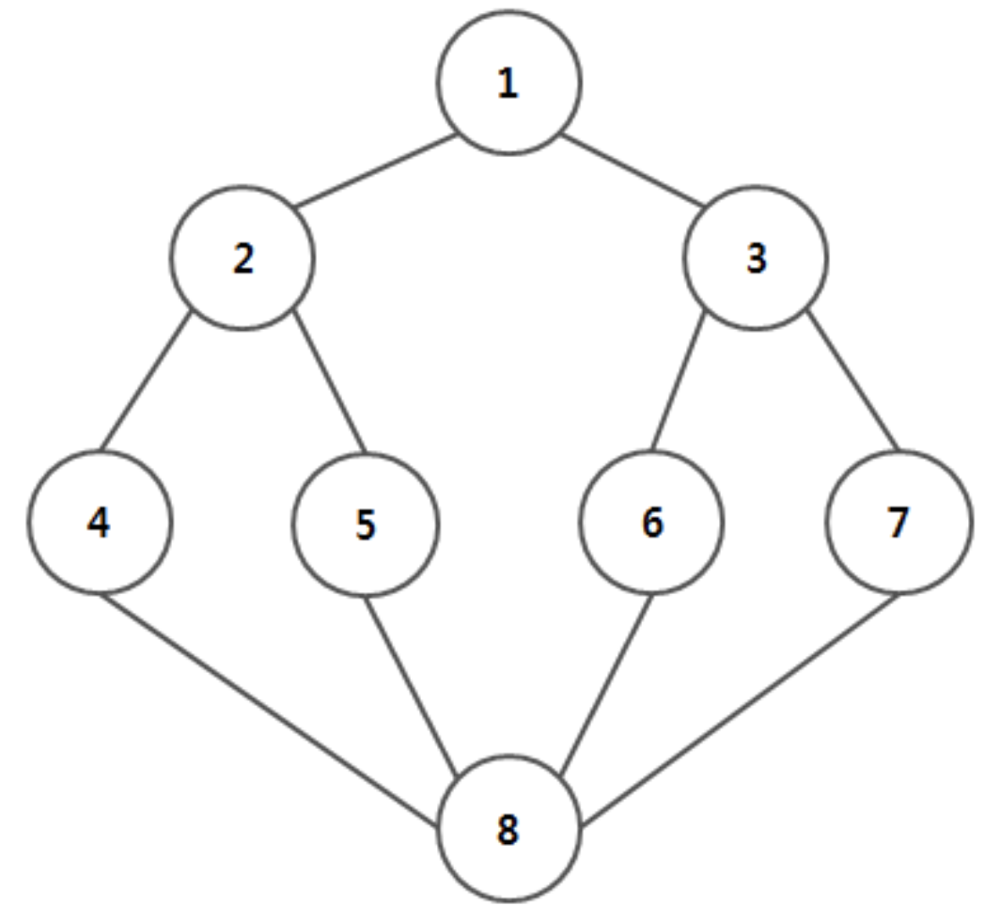
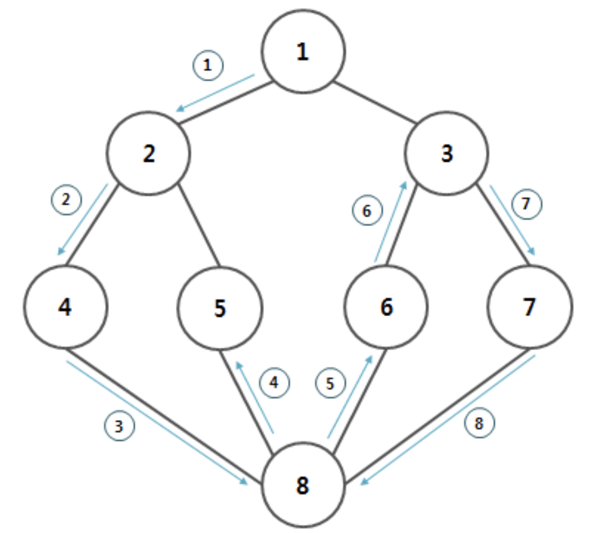

## Algorithm

### index

- 깊이 우선 탐색 (Depth First Search)
- 인접 행렬 (Adjacency Matrix)
- 너비 우선 탐색 (Breadth First Search)
- 순열 (Permutation)
- 조합 (Combination)
- 중복 순열 (Redundant Permutations), 중복 조합 (Redundant Combination)
- 다익스트라 (Dijkstra) 


### 깊이 우선 탐색 (Depth First Search)

아래의 각 노드를 정점(Vertex)이라 하고, 정점간의 선을 간선(Edge)라 한다. 깊이 우선 탐색은 한 정점을 시작으로 더 이상 깊게 들어갈 길이 없을 때까지 탐색하는 알고리즘을 말한다. 



위와 같은 그림에서 1번 정점을 시작으로 탐색을 할 경우, 탐색 순서는 ```1 -> 2-> 4 -> 8 -> 5 -> 6 -> 3 -> 7``` 순으로 탐색이 진행된다.



위와 같은 방법을 정점과 정점 사이의 인접 관계를 나타내기 위해서 인접 행렬(Adjacency Matrix)를 사용할수 있다. 

깊이 우선 탐색은 현 경로상의 모든 정점들만을 기억하면 되기 때문에 저장 공간의 수요가 비교적 적으며, 목표 정점이 깊은 단계에 있을 경우 해를 빨리 구할 수 있다. 하지만 해가 없는 경로에 깊이 빠질 가능성이 크며, 얻어진 해가 최단 경로가 된다는 보장은 없다.

```java
package dfs;

public class DFSUsingAdjacencyMatrix {

	static int n = 8;
	static int[] visit = new int[n + 1];
	static int[][] matrix = new int[n + 1][n + 1];

	private int[][] createMatrix(String edge) {

		for (int i = 0; i < edge.length(); i = i + 2) {
			int a = Integer.parseInt(edge.substring(i, i + 1));
			int b = Integer.parseInt(edge.substring(i + 1, i + 2));

			matrix[a][b] = matrix[b][a] = 1;
		}

		return matrix;

	}

	private void dfs(int start) {
		visit[start] = 1;

		for (int i = 1; i <= n; i++) {
			if (matrix[start][i] == 1 && visit[i] == 0) {
				System.out.println(start + " --> " + i);

				dfs(i);
			}
		}
	}

	public static void main(String[] args) {

		int start = 1;

		DFSUsingAdjacencyMatrix dfs = new DFSUsingAdjacencyMatrix();

		String edge = "12132425485836376878";

		dfs.createMatrix(edge);

		for (int[] elements : matrix) {

			for (int ele : elements)
				System.out.print(ele + " ");

			System.out.println();
		}

		dfs.dfs(start);

	}
}

```


-----

### 인접 행렬 (Adjacency Matrix)

인접 행렬이란 정점의 인접 관계를 행렬을 통해 나타내는 것을 말한다. 


정점 i와 정점 j가 서로 연결되어 있는 관계일 경우에는 (i, j)가 1이며, 연결되지 않았을 경우에는 (i, j)에 0이 들어간다. 인접 행렬은 대각선을 기준으로 대칭이 되며, 정점 1과 정점 3이 연결되어 있는 상태일 경우 (1, 3)과 (3, 1)이 1이어야 한다.

-----

### 너비 우선 탐색 (Breadth First Search)


-----

### 순열 (Permutation)

순열은 중복없이 n개 중에서 r개를 뽑아 순서를 정해 나열하는 경우에 사용된다. n개 중 r개를 택해 일렬로 정령하는 방법의 수는 첫 번째 자리의 문자를 택하는 경우의 수(n)와 남은 문자 중 두 번째 자리에 놓는 경우의 수(n-1)를 곱한 것과 같다. 서로 다른 n개에서 r개를 선택하는 순열의 모든 경우의 수는 nPr로 표시된다.

- nPr = n!/(n-r)!, nP0은 1, nPn은 1 (모두 선택하거나, 아무것도 선택하지 않을 경우의 수)

문자 [A, B, C]가 있을 때, 재귀적으로 해결하는 방법은 아래의 그림과 같이 트리 형태로 순열의 모든 경우를 구할 수 있다.


첫 번째 자리가 A인 경우, 배열의 첫 번째 자리 인자인 A를 첫 번째 자리 인자인 A와 바꾼다. 첫 번째 인자가 B로 설정되는 경우는 배열의 첫 번째 자리 인자인 A를 두 번째 자리 인자인 B와바꾸는 것이고, 세 번째 인자가 C로 설정되는 경우는 첫 번째 자리 인자인 A를 세 번째 자리 인자인 C와 바꾸는 것이다. 이렇게 반복적인 형태를 통해 트리 구조의 맨 처음 부분은 아래와 같이 인자가 바뀐다.

- [A] <—> [A]
- [A] <—> [B]
- [A] <—> [C]

첫 번째 자리의 인자가 확정되고, 그 하위 인자들의 값이 재귀적으로 바뀌어야 한다. 위와 같은 방법을 사용하여 아래와 같이 바꿀수 있다.

- AB <—> AB
- AB <—> AC

마지막 경우는 아래와 같다.

- ABC <—> ABC
- ACB <—> ACB

첫 번째 자리의 인자가 A인 경우를 모두 살펴봤으니, 다시 처음으로 돌아가 A <--> B인 경우를 위와 같이 구한다. 순열을 구하는 문제의 기본 공식은 nPk로, n 개 중 k 개로 이루어진 순열을 구하는 것이다. 시그니처는 다음과 같다.

- perm(int[] arr, int depth, int n, int k)

depth는 현재 트리 구조에서 어떤 깊이에서 교환 작업을 하고 있는지에 대한 변수이다.재귀적으로 깊이 탐색을 하므로 0에서 1로 증가하는 형태가 아닌, 트리의 탐색 구조로 0, 1, 2, 3, 2, 3, 1, 2, 3 ...과 같은 형태로 변한다.

``` java
private void perm(int[] arr, int depth, int n, int k) {
  if (depth == k){
    printArr(arr, k);
    return;
  }
  
  for (int i = depth; i < n; i++){
    swap (arr, i, depth);
    perm (arr, depth + 1, n, k);
    swap (arr, i, depth);
  }
}
```

depth에 따라서 for 문의 시작점은 다르다. depth가 0이라면 1XXX, 2XXX, 3XXX, 4XXX를 뽑아줘야 하며, n 번만큼 반복문이 수행된다. 시작은 depth에서 종료는 n번까지 이다.

- depth == 0 —> 1XXX, 첫 번째 자리의 값이 만들어진다.
- depth == 1 —> 12XX, 13XX, 14XX, 두 번째 자리의 값이 만들어진다.
- depth == 2 —> 123X, 세 번째 자리의 값이 만들어진다.
- depth == 3 —> 1234, 마지막 자리의 값까지 만들어진다.
- depth == k —> depth와 k의 값이 일치하면 배열을 출력하고 return 한다.

이 때 배열의 값을 바꾸는 일반적인 swap 함수를 두 번 사용한다. depth와 k의 값이 같을 때, 이를 출력하고 트리의 해당 노드의 상위 노드로 되돌아가야하기 때문이다. 실행을 해보면 각 자리를 순열하는 값이 출력된다.

-----

### 조합 (Combination)

중복없이 n개 중 r개를 순서에 상관없이 뽑는 것이다. 대표적인 예로 시간이 서로 다른 4 과목 A, B, C, D 중 2 개만 선택해서 수강 신청하는 경우는 [A, B], [A, C], [A, D], [B, C], [B, D], [C, D]가 있다. 조합을 구하는 공식은 아래와 같다.

- nCr = n-1Cr-1 + n-1Cr

원소가 1, 2, 3에서 2 개를 골라는내는 조합이라 가정할 때, (1, 2), (2, 3), (1, 3)이 있으며, 이는 (1, X)와 (X, X)인 경우로 나눌 수 있다. 이를 공식과 비교해보면 (1, X)는 1이 고정이며 나머지의 수만 구하면 된다 이는 n-1Cr-1이 될 수 있다. 두 번째는 1을 제외한 경우이므로 n-1Cr을 의미한다, 최종적으로 이를 더하면 nCr이다. 이를 식으로 표한하면 아래와 같다.

```java
public int combination (int n, int r){
  if(n == r || r == 0)
    return 1;
  
  else
    return combination (n - 1, r - 1) + combination(n - 1, r);
}
```

시그니처는 다음과 같다.

```java
combination (int[] arr, int index, int n, int r, int target)
```

- 앞자리 하나가 정해져있고 n-1로 나머지는 구하는 경우
- 앞지리는 다른 걸로 정해졌다고 가정했을 때 r개로 나머지는 구하는 경우

index는 배열에 특정 원소가 정해졌다는 의미로 사용되며, +1을 해주고, r-1 인자를 주어야 한다. target은 원소들의 집압 안에서 어떤 다른 숫자를 타겟으로 배열에 집어 넣을지를 선택할 때 사용된다. 

```java
public static void combination (int[] arr, int index, int n, int r, int target) {
	if (r == 0)
      printArray(arr, index);
 
  	else if (target == n) 
      return;
  
  else {
    arr[index] = target;
    combination(arr, index + 1, n, r = 1, target + 1);
    combination(arr, index, n, r, target + 1);
  }
  
}
```

다른 조합 코드와는 다르게 n의 값을 줄이는방법 이외에 target의 값을 증가 시킨다.

-----

### 중복 순열 (Redundant Permutations), 중복 조합 (Redundant Combination)

todo

-----

### ref

- [깊이 우선 탐색](http://blog.eairship.kr/268)
- [깊이 우선 탐색_wiki](https://ko.wikipedia.org/wiki/%EA%B9%8A%EC%9D%B4_%EC%9A%B0%EC%84%A0_%ED%83%90%EC%83%89)
- [너비 우선 탐색](http://blog.eairship.kr/269?category=431859)