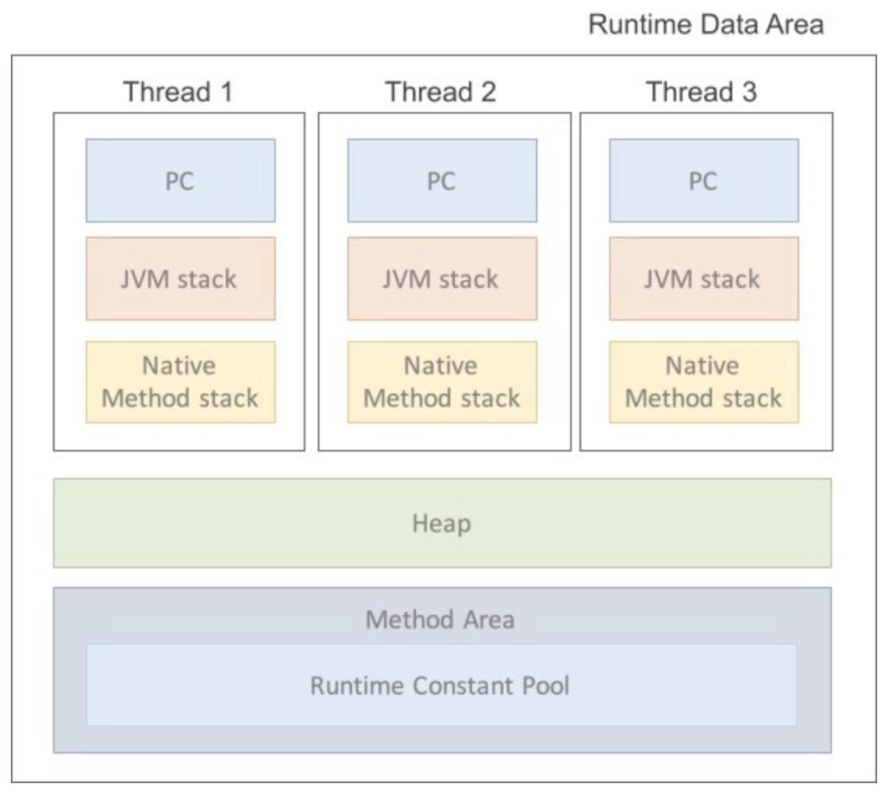
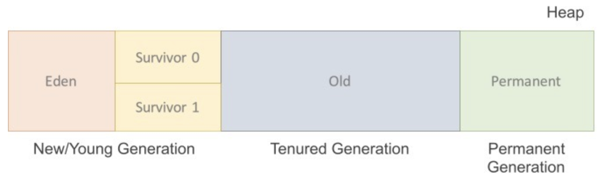
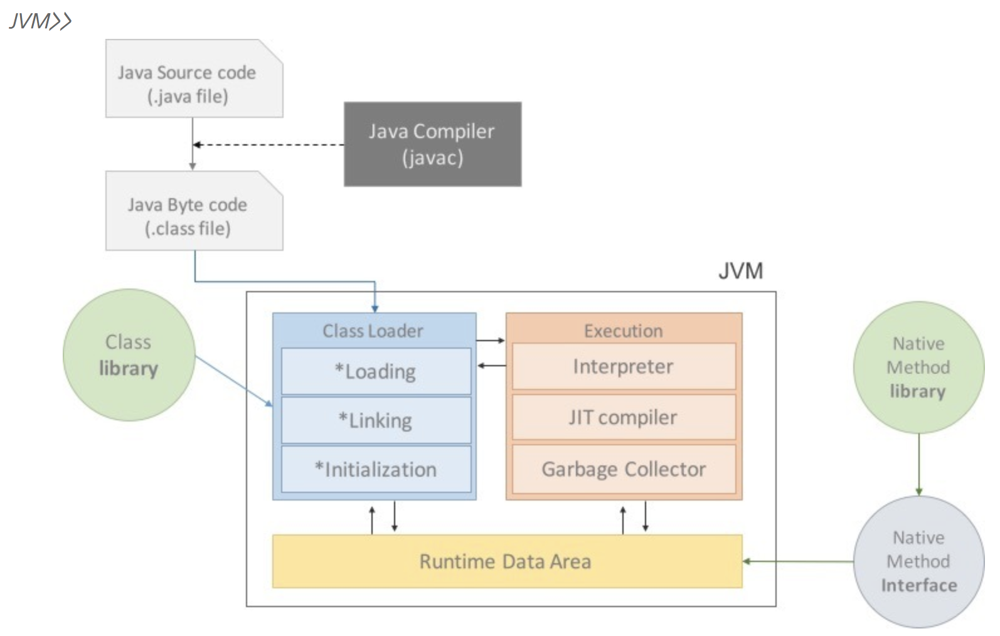
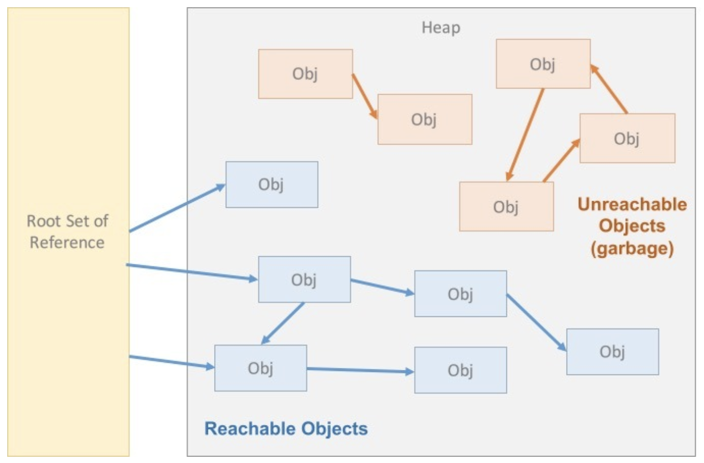
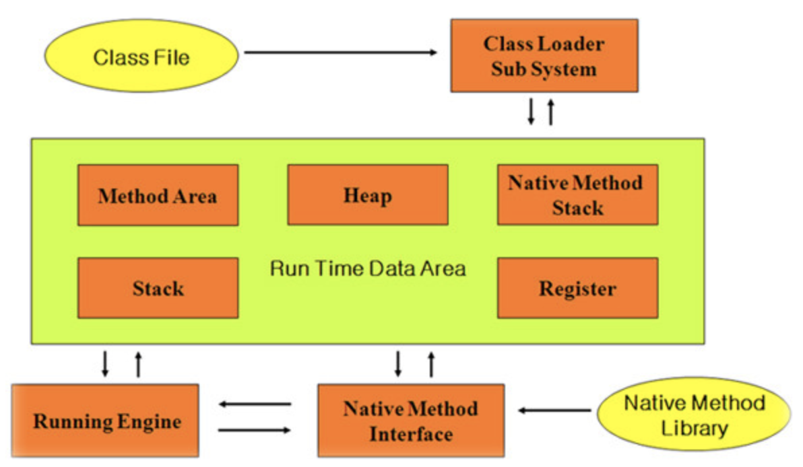
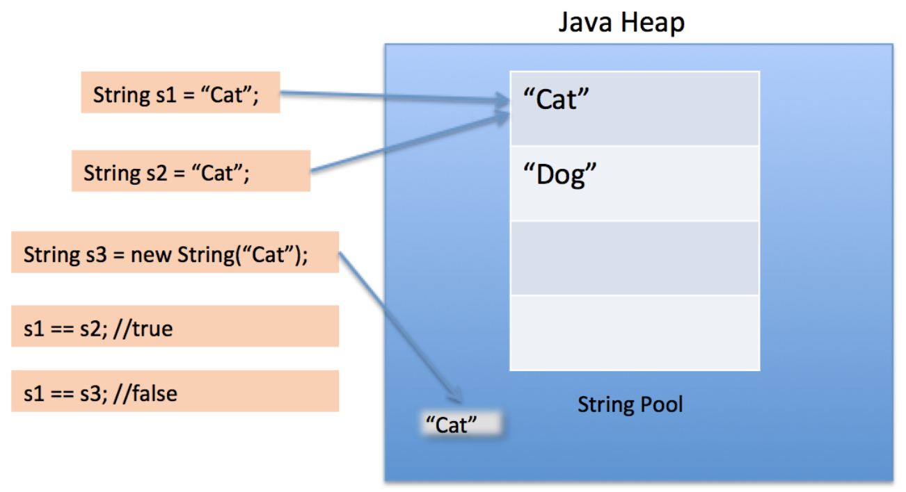
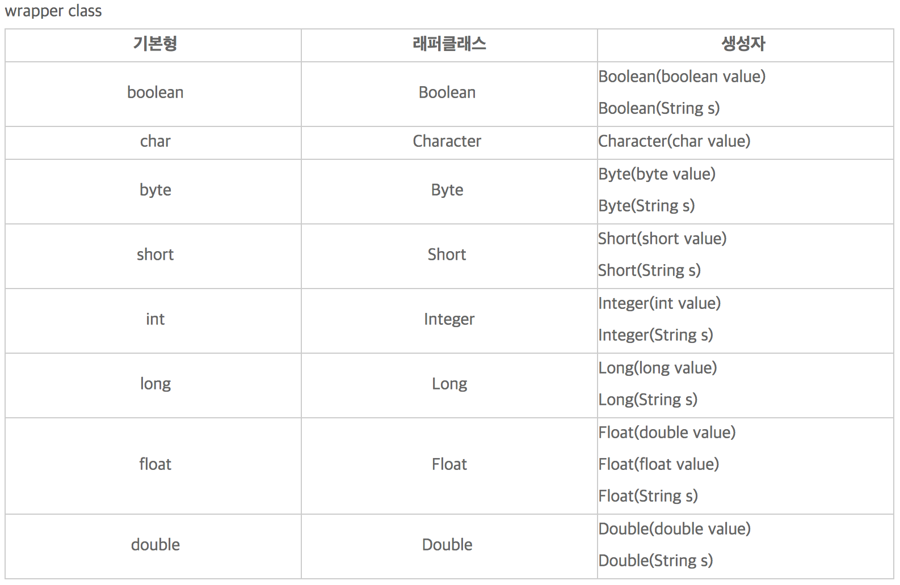
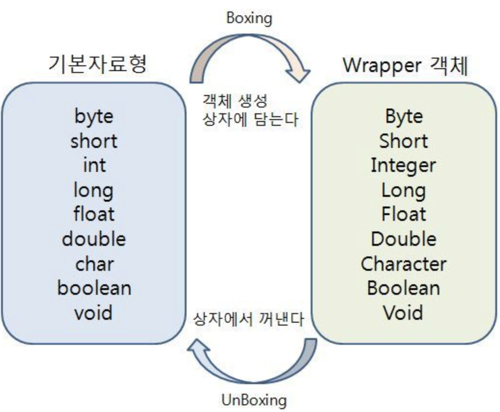
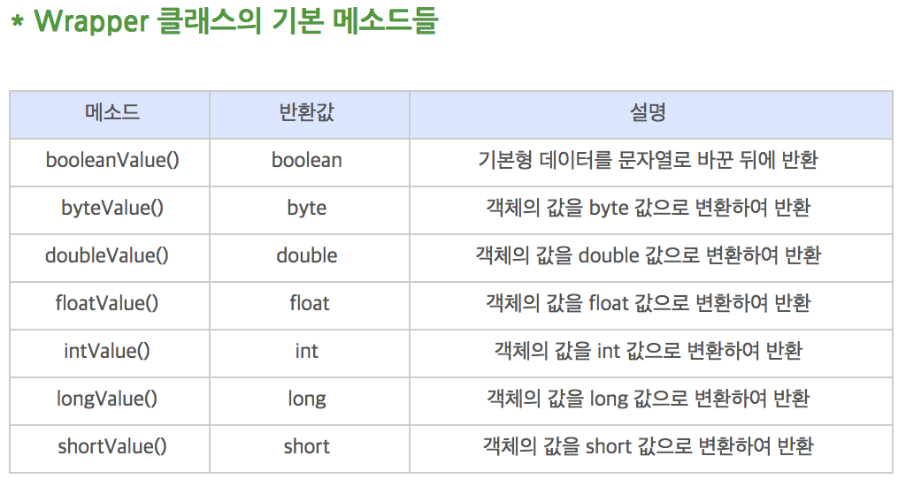
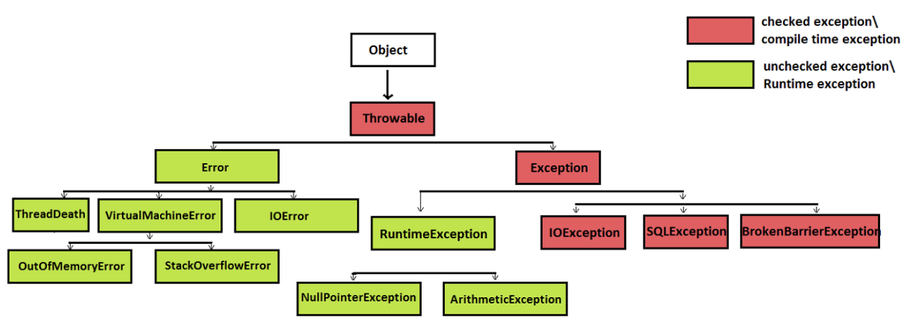

## ㅌBasic of JAVA

### index

- JVM (Java Virtual Machine)
- GC (Garbage Collection)
- String, StringBuilder, StringBuffer
- Collection
- Annotation
- Reflection
- Generic
- final
- static
- Abstract Class
- Interface
- 추상 클래스와 인터페이스 차이
- Overriding, Overloading
- Access Modifier
- Wrapper Class
- Boxing, UnBoxing
- AutoBoxing, AutoUnBoxing
- Call By Value & Call By Reference
- Exception
- Ref


-----

## JVM (Java Virtual Machine)

프로그램을 실행시키기 위한 물리적 머신과 유사한 머신을 소프트웨어로 구현한 것을 가상 머신(Virtual Machine)이라 부르며, 자바 환경에서 소프트웨어로 구현된 가상 머신을 자바 가상 머신(JVM, Java Virtual Machine)이라 한다. 자바 어플리케이션을 클래스 로더를 통해 읽어 들여 자바 API와 함께 실행하는 것을 의미하며, 자바 클래스 로더(Java Class Loader)는 자바 클래스를 자바 가상 머신으로 동적 로드하는 자바 런타임 환경(JRE, Java Runtime Environment)이다. 자바는 동적으로 클래스를 읽어오며 런타임에 모든 코드가 JVM에 링크된다. 모든 클래스는 그 클래스가 참조되는 순간 동적으로 JVM에게 링크되며 메모리에 적재된다. JVM은 JAVA와 OS 사이에서 중계자 역할을 하며, JAVA가 OS에 구애받지 않고 재사용 할 수 있는 기능을 지원한다. Garbage Collection을 통해 동적으로 할당한 메모리 영역 중 일부 사용하지 않는 영역을 해제하여 메모리를 관리한다. JVM은 스택 기반의 가상 머신이다.

우리가 JVM을 학습하는 이유는 메모리의 효율성을 극대화하기 위해 메모리 구조에 대한 이해가 필요하며, 이를 관리하는 개체를 이해함으로써 속도 저하 현상 또는 튕김 현상 방지 등의 버그 및 에러를 처리하며 효율성을 극대화하기 위함이다.

JVM의 클래스 로더(Class Loader), 실행 엔진(Execution Engine), 런타임 데이터 영역(Runtime Data Area)으로 크게 3 가지로 구성된다.

- 클래스 로더 (Class Loader)

  클래스(.class) 파일을 JVM 내로 로드하며, 링크를 통해 배치하는 작업을 수행하는 모듈이다. 런타임 (Runtime) 시점에서 동적으로 클래스를 로딩하며, 클래스의 인스턴스를 생성하면 클래스 로드에 의해 메모리에 로딩된다. jar 파일 내에 저장된 클래들을 JVM 위에 적재하고, 사용하지 않는 클래스들은 메모리에서 삭제한다.

- 실행 엔진 (Execution Engine)

  클래스 로더가 JVM 내의 런타임 데이터 영역에 바이트 코드(Byte Code)를 배치시키면 이를 실행시키는 역할을 한다. 바이트 코드는 기계가 바로 수행할 수 없는 비교적 인간이 보기 편한 형태이며, 실행 엔진은 이를 실제 JVM 내부에세 기계가 실행할 수 있는 형태로 변경한다. JVM은 두 가지 방식을 사용하여 변경한다.

  - Interpreter (인터프리터): 실행 엔진이 자바 바이트 코드를 명령어 단위로 읽어서 실행한다.
  - JIT (Just-In-Time): 인터프리터 방식의 단점을 보완하기 위해 도입된 컴파일러로, 기본적으로는 인터프리터 방식으로 실행하다가 적절한 시점에 바이트 코드 전체를 컴파일하여 네이티브 코드로 변경하여 직접 실행하는 방식이다. 네이티브 코드는 캐시에 보관되기 때문에 한 번 컴파일된 코드는 추가적인 컴파일 없이 빠르게 수행된다.

  JIT 컴파일러가 컴파일하는 과정은 바이트 코드를 인터프리팅하는 것보다 오래 걸리기 때문에 한 번만 실행되는 코드라면 컴파일하지 않고 인터프리팅하는 것이 유리하다. 따라서 JIT 컴파일러를 사용하는 JVM은 내부적으로 해당 메서드가 얼마나 자주 수행되는지 체크하며 필요에 따라 컴파일을 수행한다.

- 런타임 데이터 영역 (Runtime Data Area)

  JVM이 프로그램을 수행하기 위해 OS로부터 할당받은 메모리 영역이며, 크게 5 가지 영역으로 구성된다.

  

  - PC Register

    스레드가 시작될 때 생성되며, 각 스레드마다 하나씩 존재한다. 스레드가 어떤 부분에서 어떤 명령으로 실행해야 할 지에 대한 기록을 담당하며, 현재 수행중인 JVM 명령의 주소를 갖는다.

    프로그램의 실행은 CPU에서 명령어, 즉 인스트럭션(Instruction)을 수행하는 과정으로 이루어지며, CPU는 이러한 인스트럭션을 수행하는 동안 필요한 정보를 레지스터라는 CPU 내의 기억장치를 사용한다. 연산의 결과 값을 메모리로 전달하기 전에 CPU가 잠시 저장하고 있어야하며, 이때 사용하는 CPU 내의 기억장치를 의미한다.

  - JVM Stack

    프로그래머 실행 과정에서 임시로 할당되었다가 메소드를 빠져나가면 소멸되는 특성의 데이터를 저장하기 위한 영역으로, 각종 형태의 변수, 임시 데이터, 스레드, 메소드 정보 등이 담긴다. 메소드 호출시 각 스택 프레임(메서드만의 공간)이 생성되며, 메서드 수행 종료 시 프레임 단위로 삭제된다. 

  - Native Method Stack

    자바 프로그램이 컴파일되어 생성되는 바이트 코드가 아닌 실제 실행할 수 있는 기계어(Native Code)로 작성된 프로그램을 실행시키는 영역으로, Java Native Interface를 통해 바이트 코드로 전환하여 저장된다. 일반적인 프로그램처럼 커널이 스택을 잡아 독자적으로 프로그램을 실행시키는 영역이다. 기계어로 되어있는 function의 호출을 자바 프로그램 내에서 직접 수행할 수 있으며, 그 결과 값을 받아 올 수도 있다.

  - Method Area (Class Area, Static Area)

    클래스 정보를 처음 메모리에 올릴 때 초기화되는 대상을 저장하기 위한 영역으로, 컴파일된 바이트 코드의 대부분이 메소드 바이트 코드이기 때문에 대부분의 바이트 코드가 로딩된다. 내부에 별도로 Runtime Constant Pool이라는 관리 영역이 존재하며 상수 자료형을 저장하여 참조하고 중복을 막는 역할을 수행하며, 해당 영역에 올라가는 정보는 3 가지로 나뉜다.

    - Field Information: 멤버 변수의 이름, 데이터 타입, 접근 제어자에 대한 정보
    - Method Information: 메소드의 이름, 리턴 타입, 매개 변수, 접근 제어자에 대한 정보
    - Type Information: Class / Interface 구분 저장, Type 속성, 전체 이름, Super Class의 정보

    Method Area는 클래스를 위한 공간이며, Heap 영역은 객체를 위한 공간이다.

  - Heap Area

    객체를 저장하는 가상 메모리 공간이며, new 연산자로 생성된 객체와 배열이 저장된다. Method Area에 로딩된 클래스만 객체를 생성할 수 있으며, 해당 영역은 세 부분으로 나뉜다.

    

    - Permanent Generation

      생성된 객체 정보의 주소 값이 저장되는 공간으로, 클래스 로더에 의해 로드된 Class, Method 등의 메타 정보(Meta)가 저장되는 영역이다. Reflection을 사용하여 동적으로 클래스가 로딩되는 경우 사용된다.

    - New / Young Generation

      Eden: 객체가 최초로 생성되는 공간

      Survivor 0/1: Eden에서 참조되는 객체들이 저장되는 공간

    - Tenured Generation (Old)

      New 영역에서 일정 시간 참조되고 있는, 살아남은 객체들의 저장 공간이다. Eden 영역에 객체가 가득차게 되면, 첫 번째 GC(Minor GC)가 발생한다. Eden 영역에 있는 값을 Survivor 1 영역에 복사하고 이 영역을 제외한 나머지 영역의 객체를 삭제한다. 인스턴스는 소멸 방법과 소멸 시점이 지역 변수와는 다르기 때문에 힙이라는 별도의 영역에 할당된다. 자바 가상 머신은 합리적으로 인스턴스를 소멸시키며, 더 이상 인스턴스의 존재 이유가 없을 경우 소멸시킨다.

JVM의 전체적인 흐름은 아래와 같다.



- 프로그램이 실행되면 JVM은 OS로부터 해당 프로그램이 필요로 하는 메모리를 할당받는다. 할당 받은 메모리는 JVM이 용도에 따라 여러 영역으로 나누어 관리한다.
- 자바 컴파일러(Javac)가 자바 소스 코드(.java)를 읽어들여 자바 바이트 코드(.class)로 변환시킨다.
- 변환된 자바 바이트 코드(.class) 파일은 클래스 로더를 통해  JVM으로 로딩된다.
- 로딩된 자바 바이트 코드(.class) 파일은 실행 엔진 (Execution Engine)을 통해 해석된다.
- 해석된 바이트 코드는 Runtime Data Areas 영역에 배치되어 실질적인 수행이 이루어진다.
- 이러한 과정 속에서 JVM은 주기적으로 Thread Synchronization과 Garbage Collection과 같은 관리 작업을 수행한다.


-----

## GC (Garbage Collection)

가비지 컬렉션은 프로그래머가 사용하지 않는 객체를 대신 소실(Destroying)시킴으로써, 힙 메모리를 관리한다. 기본적으로 백 그라운드에서 운용되는 데몬 스레드이다. 가비지 컬렉션이 힙을 관리하는 과정은 아래와 같다. 가비지 컬렉터는 힙 메모리 내의 객체 중 사용되지 않는 객체를 가비지(Garbage)로 정하고 이를 처리하여 힙 메모리를 회수한다.


- Minor GC

  새로 생성되는 객체는 Eden 영역에 위치하며, GC가 한 번 발생한 후 소실되지 않은 객체는 Survivor 영역으로 이동한다. 이 과정을 반복하다가 계속해서 살아남은 객체는 일정 시간동안 참조되고 있음을 뜻하기에 Old 영역으로 이동된다.


- Major GC

  Old 영역에 있는 객체를 검사하여 참조되지 않는 객체를 한 번에 삭제한다. 이러한 작업은 시간이 오래 걸리며, 삭제 과정 시에 실행 중인 프로세스가 정지된다. 이것을 "Stop-The-World"라 부르며, Major GC가 발생하면 GC를 실행하는 스레드를 제외한 나머지 스레드의 작업이 일시 중단되고, GC가 작업을 완료하면 중단된 나머지 스레드의 작업이 재시작한다.

가비지 컬렉션은 어떤 기준과 원리로 소멸 대상을 객체를 선정하고 소실시키는 지는 아래와 같다.

- 참조되지 않는 객체를 가비지(Garbage)라하며, 객체가 참조되는지를 판단하기 위해서는 Reachability라는 개념을 사용한다. 힙 영역에서 할당된 객체가 참조되고 있다면 Reachability, 참조되고 있지 않다면 Unreachability라 한다. 객체를 처음 참조하는 것을 Root Set이라하며, 어떠한 특정 객체가 다른 객체를 참조하고 있고 다른 객체는 또 다른 객체를 참조할 수 있으면, 이를 참조 사슬이 형성되었다고 한다. 힙 영역에 있는 객체들은 총 4 가지 경우에 대한 참조 형태를 띈다.

  

  1: 힙 메모리 안에서 다른 객체에 의한 참조

  2: JVM 스택(JVM Stack), Java 메소드 실행 시 사용되는 지역 변수와 파라미터에 의한 참조

  3: 네이티브 스택(JNI, Java Native Interface)에 의해 생성된 객체에 대한 참조

  4: 메서드 영역의 정젹 변수에 의한 참조

  위의 4가지 경우 중 2, 3, 4 번의 경우 Root Set이라 한다. 참조 사슬 중 최초에 참조한 것을 의미한다. 빈번한 가비지 컬렉션의 실행은 시스템에 부담이 될 수 있다. 따라서 성능에 영향을 미치지 않도록 별도의 알고리즘 기반의 계산을 통해 가비지 컬렉션의 실행 타이밍을 기준으로 가비지 컬렉션이 수행된다.

  

-----

## String, StringBuilder, String Buffer

먼저 String, StringBuilder, String Buffer에 대한 내용에 들어기가 전에 불변 객체(Immutable Object)에 대해 알아보도록 한다. 

- **불변 객체 (Immutable Object)**

  객체 지향 프로그래밍에 있어서 불변 객체(Immutable Object)는 생성 후 그 상태를 바꿀 수 없는 객체를 말한다. 반대 개념으로는 가변 객체(Mutable Object)로 생성 후에도 상태를 변경할 수 있다. 경우에 따라 내부에서 사용하는 속성이 변하더라도 외부에서 그 객체의 상태가 변하지 않는 것처럼 보인다면, 이는 불변 객체로 간주된다. 예를 들어 비용이 큰 계산에서 그 결과를 캐시에 임시로 저장하는 메모이제이션(Memoization)의 경우 그 객체는 여전히 불변하다. 불변 객체의 장점은 복제, 비교를 위한 조작을 단순하할 수 있고 성능 개선에 도움을 준다. 만일 객체가 변경 가능한 데이터를 많이 가지고 있는 경우, 객체가 변경될 때 새로운 객체와 데이터를 생성해야하기 때문에 성능에 영향을 끼친다. 불변 객체는 객체를 복제할 때 객체 전체가 아닌 단순한 참조 복사가 이루어지며, 참조는 보통 객체 자체보다 훨씬 작은 크기를 지닌다. 일반적으로 포인터 크기 정도이며, 이는 메모리 사용이 절약되는 장점을 가진다. 반대로 가변 객체의 참조를 가지고 있는 경우, 어떤 특정 장소에서 객체를 변경하면 참조를 공유하는 모든 장소에서 그 영향을 받는다. 때문에 멀티 스레드 프로그래밍에서는 불변 객체가 유용하다. 불변의 특징을 가지고 있기 때문에 복수의 스레드 중 특정 스레드가 데이터를 변경하여도 다른 스레드에게 영향을 주지 않는다. 베타 제어(Mutual Exclusion)가 필요하지 않고 불변 객체가 가변 객체보다 스레드 세이프(Thread-Safe)하다.

- **String**

  자바에서 String은 참조 자료형이자, 불변 객체이다. String 객체는 한 번 생성되면 할당된 메모리 영역이 변하지 않으며, + 연산자 또는 concat 메소드를 통해 기존에 생성된 String 클래스의 객체 문장에 다른 문자열을 붙여도 기존 문자열에 새로운 문자열이 붙는 형식이 아닌, 두 개의 문자열을 붙인 새로운 String 객체를 생성하여 이를 참조하고, 기존의 String 객체는 GC에 의해 소멸된다. String 클래스의 객체는 힙 메모리 영역에 생성되며, 한 번 생성된 객체의 내용을 변화시킬 수 없다. 따라서 문자열 연산이 많은 경우, String 객체를 사용하게 되면 성능 저하의 원인이 될 수 있다. 불변 객체는 간단한 참조 사용에 효율적이며 멀티 스레드 환경에서 동기화에 대한 문제가 발생하지 않는다. 결과적으로 스레드 세이프(Thread Safe)하며, 내부 데이터를 자유롭게 공유할 수 있다.

  String 객체는 new 생성자와 리터럴 ("",큰 따옴표)을 사용함으로써, 두 가지의 방법을 통해 생성할 수 있다. 두 가지의 생성 방식은 모두 String 객체를 생성하지만, 서로 다른 메모리 영역에 생성된다.

  

  new 생성자를 이용하여 String 객체를 생성하는 경우, 해당 객체를 힙 메모리 영역에서 관리된다. 이 위치는 다른 참조 자료형과 같은 위치이다. 리터럴을 이용해 String 객체를 생성하는 경우, 해당 객체는 힙 메모리 영역 내에 있는 String Constant Pool이라는 영역에 저장된다.

  ```java
  public class StringMemory {
      public static void main(String... args) {
          String literal = "String";
          String object = new String("String");

          System.out.println(literal == object);		//	false
          System.out.println(literal.equals(object));	//	true
      }
  }
  ```

  위의 코드에서 == 연산의 결과는 false를 반환하며, equals 연산의 결과는 true를 반환한다. equals 연산의 경우 문자열을 비교하기 때문에 true를 반환하며, == 연산은 객체의 주소 값을 비교한다. 일반 객체의 경우 힙 메모리 영역에 new 연산자를 통해 생성된 String 객체와 리터럴을 통해 생성되어 String Constant Pool 영역에 저장된 String 객체는 주소 값이 다를 수 밖에 없다.

  이는 내부적인 동작 방식의 이해가 필요하다. String 객체를 리터럴로 생성하는 경우, 내부적으로 String의 intern() 메소드가 호출된다. intern() 메소드는 주어진 문자열이 String Constant Pool에 존재하는지 조회하고, 존재한다면 그 주소 값을 반환하며 존재하지 않을 경우 String Constant Pool에 주어진 문자열에 넣고 새로운 주소 값을 반환하는 메소드이다. 따라서 아래의 코드는 다음과 같은 결과를 내보인다.

  ```java
  public class StringMemoryIntern {
  	  public static void main (String... args) {
          String literal = "String";
          String object = new String("String");
          String internString = object.intern();
          
          System.out.println(literal == object);		//	false
          System.out.println(literal.equals(object));	//	true
          System.out.println(literal == internString);		// 	true
          System.out.println(literal.equals(internString));	//	true
  	}
  }
  ```

  new 연산자를 통해 생성된 String 객체는 리터럴로 생성된 String 객체와 == 연산을 했을 경우 false를 반환하였지만, intern() 메소드를 호출하여 새로운 String 객체에 대입했을 경우 == 연산에서 true를 반환한다. 이 결과는 "String" 이라는 문자열이 String Constant Pool에 저장된 후, intern() 메소드 호출을 통해 저장된 "String" 문자열의 주소 값을 반환받았기 때문이다.

  String Constant Pool은 자바의 버전에 따라 위치가 옯겨졌다. Java 6까지는 String Constant Pool의 위치가 Perm 영역에 존재했지만, OMM(Out Of Memory) 문제의 이유로 Java 7부터는 힙 영역에 존재한다. 

  Perm 영역은 고정된 크기이며, 런타임 시 크기가 확장되지 않는다. Perm 영역의 크기를 확장시킬 수 있지만, 런타임 시에 크기가 변경되는 것이 아니다. 결과적으로 Java 6에서 String의 intern() 메소드의 호출이 OutOfMemoryException을 발생시켜며, 이를 제어할 수 있는 방법이 없었다. 이에 Oracle 개발자는 Java 7부터 Perm 영역에서 Heap 영역으로 String Constant Pool의 위치를 변경하였고, Heap 영역으로 옮김으로써 String Constant Pool 내의 모든 문자열도 GC가 관리할 수 있는 이점을 얻게 되었다. 

- **StringBuffer, StringBuilder**

  StringBuffer와 StringBuilder는 String과는 다르게 가변 객체(Mutable Object)이다. 문자열 연산 등으로 기존 객체에 공간이 부족하게 되는 경우, 기존의 버퍼 크기를 늘리며 유연하게 동작한다. StringBuffer와 StringBuilder 클래스가 제공하는 메소드는 동일하다. StringBuffer와 StringBuilder의 차이점은 StringBuffer는 메서드 별 동기화 기능을 제공하며, 멀티 스레드 환경에서 동기화를 지원한다. 반면 StringBuilder는 동기화 기능을 지원하지 않기 때문에 멀티 스레드 환경에서 동기화 보장을 위해서라면 StringBuffer를 사용하고, 단일 스레드 환경에서는 StringBuilder를 사용하는 것이 좋다. 단일 스레드 환경에서 StringBuffer를 사용하는 것은 StringBuffer의 동기화 관련 처리로 인해 StringBuilder에 비해 성능이 좋지 않다. 

  String 객체를 + 연산자를 이용해 합치는 경우, 매번 객체를 생성해야하기 때문에 성능상의 문제가 많았다. 이에 JDK 1.5 버전 이후부터는 컴파일 단계에서 StringBuilder로 컴파일되도록 변경되었기 때문에 현재는 StringBuilder와 String의 문자열 연산의 성능 상의 문제는 크게 두드러지지 않는다.

- StringBuilder > StringBuffer > String

- String과 StringBuilder의 차이

  String 객체의 경우 아래의 코드와 같이 구현되어 있다면, String 객체가 연산할 때마다 새로운 String 객체를 생성해주어야함으로, 내부적으로 new 연산이 n번 실행된다.

  ```java
  String result = "";

  for (int i = 0; i < n; i++)
    result += target;
  ```

  반면, StringBuffer 객체의 경우, 문자열 연산을 할 때 버퍼의 크기를 확장할 수 있으므로 새로운 객체를 생성하지 않고 기존의 문자열을 변경한다. 따라서 아래의 코드에서 StringBuffer는 내부적으로 new 연산을 1번 실행한다.

  ```java
  StringBuffer result = new StringBuffer();

  for (int i = 0; i < n; i++)
    result.append(targer);
  ```

  결론적으로, StringBuffer 클래스는 문자열을 추가하기 위해 append()와 같은 메소드를 사용할 때 String 클래스보다 뛰어난 성능을 보이지만, StringBuffer 객체의 생성과 toString() 메소드를 통한 String 객체의 생성이 반드시 필요하므로 더 많은 시간과 메모리 자원의 낭비를 초례한다. 또한 String의 + 연산자는 횟수가 많아지면 성능이 급격히 떨어지며, 문자열을 수정하는 연산이 많은 경우 StringBuffer를 사용하는 것이 좋다. 또한 멀티 스레드 환경에서 동기화를 고려하지 않는다면 StringBuilder를, 멀티 스레드 환경에서 동기화를 고려한다면 StringBuffer를 사용하는 것이 좋다.


-----

## Collection

Java Collection에는 List, Map, Set 인터페이스를 기준으로 여러 구현체가 있으며, Stack, Queue 인터페이스도 존재한다. 이를 사용하는 이유는 다수의 데이터를 다루는데 표준화된 클래스를 제공해주기 때문에 사용하기 쉽고 데이터 구조를 직접 구현하지 않아도 된다. 또한 배열과는 다르게 객체를 보관하기 위한 공간을 미리 정하지 않아도 됨으로, 상황에 따라 객체의 수를 동적으로 정할 수 있기에 프로그램의 공간적인 효율을 높인다. 

- List

  List 인터페이스를 사용자가 직접 @Override를 통해 정의하여 사용할 수 있다. 대표적으로 ArrayList가 기본의 Vector를 개선한 것이다. 데이터 구조적인 측면에서는 배열이라 생각하면 쉽지만, 내부적으로는 Red Black Tree로 구성되어 있다. ArrayList의 단점은 멀티 스레드 환경에서 동기화 문제를 가진다.

- Map

  대표적인 구현체로는 HashMap이 있다. Key - Value의 구조를 가지며, 데이터 구조적인 측면에서는 HashTable과 같다. Key를 기준으로 중복된 값을 저장하지 않으며, 순서를 보장하지 않는다. 순서를 보장하기 위한 Map은 LinkedHashMap이 있다.

- Set

  대표적인 구현체로는 HashSet이 있으며, Value에 대한 중복 값을 저장하지 않는다. Set의 자료구조는 Map의 Key - Value 구조에서 Key 대신 Value가 들어가는 Value를 Key로 하는 자료구조이다. 순서를 보장하지 않으며, 순서를 보장하는 LinkedHashSet이 있다.

-----

## Annotation

본래의 주석이라는 뜻으로, 인터페이스를 기반으로 한 문법이다. 실질적인 기능은 주석과 다르지만, 어노테이션을 코드에 추가함으로써 클래스에 특별한 의미를 부여하거나 기능을 주입하는 역할을 한다. 어노테이션은 컴파일 타임에 처리될 수 있으며, 자바의 리플렉션을 거쳐서 런타임에 처리될 수도 있다. 리플렉션은 실행 중인 자바 클래스의 정보 조회 기능을 지원하며, 해당 클래스의 구성 정보를 확인할 수 있다. 자바는 리플렉션 기능이 있기 때문에 어노테이션을 더 효율적으로 활용할 수 있다. 어노테이션은 크게 Built-In Annotation, Meta Annotation, Costom Annotation으로 나뉜다.

- Built-In Annotation

  JDK에 내장된 어노테이션으로, 컴파일러에게 유용한 정보를 제공한다. 대표적인 어노테이션으로는 @Override, @SuppressWarnings, @FunctionalInterface 등이 있다.

- Meta Annotation

  어노테이션에 대한 정보를 표현하기 위한 어노테이션으로 해당 어노테이션의 동작 대상을 결정한다.

- Custom Annotation

  개발자가 직접 만들어내는 어노테이션

기존에는 XML 설정 파일에 명시하는 방법으로 프로그래밍되었다. 변경될 수 있는 데이터를 코드가 아닌 외부 설정 파일에 분리하기 때문에 컴파일없이 쉽게 변경할 수 있지만, 매번 많은 설정을 작성해야 하는 불편한 상황이 발생했다. 이는 웹 어플리케이션이 규모가 커지면서 부각되었고, 이를 해결하기 위해 어노테이션이 등장했다.

-----

## Reflection

리플렉션은 구체적인 클래스 타입을 알지 못해도, 특정 클래스의 메소드, 타입, 변수들을 접근할 수 있게 해주는 자바 API이다. IDE의 자동 완성 기능도 리플렉션의 일종이다. 코드를 먼저 작성하고 실행 시점에 확인해서 활용할 수 있도록 지원하는 메커니즘이다.

-----

## Generic

자바의 안정성을 담당하며, 다양한 타입의 객체를 다루는 메서드나 컬렉션 클래스에서 사용한다. 컴파일 과정에서 타입 체크 기능을 지원하며, 형 변환의 불편함을 감소시킨다. 코드가 간결해지며, 클래스를 정의할 때 데이터 타입을 확정하는 것이 아닌 인스턴스를 생성할 때 데이터 타입을 지정하는 기능을 말한다.

```java
class Person<T>{
    public T info;
}

public class GenericDemo {
    public static void main(String[] args) {
      Person<String> p1 = new Person<String>();
      // p1: 일시 데이터 타입은 String이 된다. (인스턴스 생성시 String 제네릭 생성)
        
      Person<StringBuilder> p2 = new Person<StringBuilder>();
	  // p2: 일시 데이터 타입은 StringBuilder이 된다.
      
    }
}
```

-----

## final

클래스의 멤버 변수를 상수로 만들고자 할 때, 클래스 상수(static final)로 만들곤 한다. final은 프로그래밍 언어에서 'constant', '상수'와 동등한 의미를 갖는 키워드이며, 자바에서 final은 해당 entity가 오로지 한 번 할당될 수 있음을 의미한다.

- final class

  해당 클래스는 상속할 수 없음의 의미하며, 문자 그대로 상속 계층 구조에서 마지막 클래스를 뜻한다.

- final method

  해당 메소드를 오버라이드 하거나 숨길 수 없음을 의미한다.

- final variable

  해당 변수가 생성자나 대입 연산자를 통해 한 번만 초기화가 가능함을 의미하며, 상수를 만들 때 응용된다.

final 멤버 변수가 반드시 상수는 아니다. 한 번만 초기화가 가능하다는 것을 의미한다. 아래의 예제에서 final 멤버 변수인 age는 생성자를 통해 초기화되었다. 해당 클래스의 객체들은 각기 다른 값을 지니고 있으며, 객체 안에서는 변하지 않아도, 클래스 레벨에서 통용되는 상수라고는 할 수 없다.

```java
public class Person {
  private final int age;
  
  public Person(int age) {
	this.age = age;
  }
  
  public int getAge(){
    return age;
  }
}
```

private 메소드와 final 클래스의 모든 메소드는 명시하지 않아도 final처럼 동작하며, private 메소드에 final 키워드를 명시할 수 있다.

- private: 하위 클래스에서 확인할 수 없으며, 오버라이딩도 불가능하다.
- final: 하위 클래스에서 확인할 수 있지만, 오버라이딩은 할 수 없다.

그 외의 final과는 관계없지만 비슷한 어감의 키워드

- finally

  try - catch 또는 try - catch - finally 구문을 사용하는 경우, 정상적으로 처리될 때와 에러가 발생했을 때를 포함하여 마무리하는 작업이 존재하는 경우 코드를 작성해주는 코드 블럭이다.

- finalize()

  GC에서 호출되는 메소드로, Object 클래스에 정의되어 있으며 GC가 발생하는 시점이 불분명하기 때문에 해당 메소드가 실행된다는 보장이 없다.

-----

## static

static 키워드는 프로그래밍 언어에서 '전역', '정적'의 의미로 통용된다. 

- static 멤버 변수

  클래스 변수라고도 부르며, 모든 해당 클래스는 같은 메모리를 공유한다. 특정 인스턴스에 종속되어 있지 않으며, 인스턴스를 생성하지 않아도 사용 가능하다.

- static 메소드

  클래스 메소드라고도 부르며, 하위 클래스에서 확인할 수 없고, 오버라이딩도 할 수 없다.

- static 블록

  클래스 내부에서 만들 수 있는 초기화 블록으로, 클래스가 초기화 될 때 실행되고, main() 보다 먼저 수행된다. 

- static import

  다른 클래스에 존재하는 static 멤버를 불러올 때 사용하며, 멤버 메소드를 곧바로 사용할 수 있다.

-----

## Abstract Class

추상 클래스(Abstract Class)는 인터페이스 역할도 하면서 구현체를 가지고 있는 클래스이다. 추상 클래스를 만들기 위해서는 class 앞에 ```abstract```라고 표기해야 한다. 또한 인터페이스와 같은 역할을 하는 메소드에도 ```abstract```를 붙인다. 추상 메소드는 구현체가 없으며, 추상 클래스를 상속하는 클래스에서 해당 추상 메소드를 구현해야 한다.

```java
public abstract class Predator extends Animal {
  public abstract String getFood();
}

public class Tiger extends Predator implements Barkable {
  
  public String getFood(){
    return "apple";
  }
  
  public void bark() {
    System.out.println("어흥");
  }
}

public class Lion extends Predator implements Barkable {
  
  public String getFood(){
    return "banana";
  }
  
  public void bark(){
    System.out.println("으르렁");
  }
}
```

위의 Tiger 클래스와 Lion 클래스는 Predator 추상 클래스를 상속한다. Predator 추상 클래스에서 추상 메소드로 선언된 getFood 메소드를 Tiger 클래스와 Lion 클래스가 각각 구현하고 있다. 이와 같이 추상 클래스를 상속하는 클래스는 추상 클래스가 가지고 있는 ```abstract``` 키워드로 선언된 메소드를 반드시 구현해야 한다. 또한 추상 클래스는 추상 메소드 뿐만 아니라 실제 메소드가 존재 할 수 있다.

```java
public abstract class Predator extends Animal {
  public abstract String getFood();
  
  public boolean isPredator(){
    return true;
  }
} 
```

-----

## Interface

인터페이스는 자바 프로그래밍 언어에서 클래스들이 구현해야 하는 동작을 지정하는데 사용되는 추상형이다. 이들은 프로토콜과 비슷하며, ```interface```라는 키워드를 사용하여 선언한다. 메소드 시그니처(반환 타입, 메소드 식별 이름, 파라미터 타입과 값)와 상수 선언(static과 final이 둘 다 선언된 변수 선언)만을 포함할수 있다. 인터페이스의 바디(body)는 추상 메소드를 포함하고 있지만 인터페이스 내의 모든 메소드들이 정의상 추상적이기 때문에 ```abstract```키워드가 필요하지 않다. 인터페이스는 노출된 행동들의 집합을 규정하므로 모든 메소드들은 암묵적으로 ```public```이다.

```Java
public interface Predator {
  boolean chasePrey (Prey p);
  void eatPrey (Prey p);
}

public class Lion implements Predator {
  
  @Override
  public boolean chasePrey (Prey p){
    // do something
  }
  
  @Override
  public void eatPrey (Prey p){
    // do something
  }
}
```

해당 클래스가 인터페이스를 구현하면서 메소드를 모두 구현하지 않는다면, ```abstract```로 표시되어야 한다. 클래스가 추상적이라면 서브 클래스들 중 하나가 미구현 메소드를 구현할 것이라 예측한다. 추상 클래스의 서브 클래스들 중 어느 것도 인터페이스 메소드를 모두 구현하지 않더라도 서브 클래스 자체는 ```abstract```로 다시 표시되어야 한다.

-----

## 추상 클래스와 인터페이스의 차이

추상 클래스는 구체화 시킬 구현체를 추상화시키는 기법이며, 인터페이스는 구현할 컴포넌트의 표준을 정의하는 것이다. 추상 클래스와 인터페이스는 상속받은 클래스 또는 구현하는 인터페이스 안에 있는 추상 메소드를 구현하도록 강제한다.

클래스는 크게 일반 클래스와 추상 클래스로 나뉘며, 추상 클래스는 클래스 내에 추상 메소드가 하나 이상 포함되어 있거나, ```abstract```로 정의된 경우를 말한다. 인터페이스는 모든 메소드가 추상 메소드인 경우를 말하며 자바 8에서 ```default```키워드를 이용해서 일반 메소드를 구현할 수 있다. 

추상 클래스와 인터페이스는 존재의 목적이 다르다. 추상 클래스는 그 추상 클래스를 상속받아서 기능을 이용하고 확장시키는데에 있으며, 인터페이스는 함수의 껍데기만 제공함으로써 해당 함수의 구현을 강제하기 위해서이다. 구현을 강제함으로써 구현 객체의 같은 동작을 보장하지 않는다. 

-----

## Overriding, Overloading

- Overriding

  오버라이딩은 상속받은 클래스에 존재하는 메소드를 하위 클래스에서 필요에 맞게 재정의 하는 것을 의미한다.

- Overloading

  오버로딩은 같은 클래스 내에 반환 값과 메소드 이름이 동일한 메소드를 매개 변수만 다르게 만들어 다양한 상황에서 메소드가 호출될 수 있도록 하는 것이다.

-----

## Access Modifier

변수 또는 메소드의 접근 범위는 설정해주기 위해 사용하는 Java의 예약어를 의미한다.

|    종류     |                    정의                    |
| :-------: | :--------------------------------------: |
|  public   |             어떤 클래스에서도 접근이 가능             |
| protected | 클래스가 정의되어 있는 해당 패키지와 해당 클래스를 상속받은 외부 패키지의 클래스에서 접근 가능 |
| (default) |      클래스가 정의되어 있는 해당 패키지 내에서만 접근 가능      |
|  private  |           정의된 해당 클래스에서만 접근 가능            |

-----

## Wrapper Class

자바는 기본형(Primitive Type)과 참조형(Reference Type)으로 나뉘며, 데이터를 저장할 때 기본형 타입의 변수에 저장하거나 다양한 객체를 저장할 수 있는 컨테이너 역할을 하는 객체를 생성할 수 있다. 상황에 따라 기본형 타입을 객체로 사용하거나, 기본형 타입 값을 객체로 포장할 필요가 있다. 

- 매개 변수로 객체가 요구될 때
- 기본형 값이 아닌 객체로 저장해야 할 때
- 객체간의 비교가 필요할 때

자바의 각 기초 타입에 대해 자바 클래스 라이브러리 내에 상응되는 Wrapper Class가 존재하며, 모든 Wrapper Class는 java.lang 패키지에 정의된다.



-----

## Boxing, UnBoxing

Wrapper Class는 산술 연산을 위해 정의된 클래스가 아니기 때문에, 해당 클래스의 인스턴스에 저장된 값을 변경하는 것이 불가능하다. 값을 저장하는 새로운 객체의 생성 및 참조만 가능하다.

```java
Integer age = new Integer(29);
int age2 = age.intValue();
```



-----

## AutoBoxing, AutoUnBoxing

JDK 1.5 버전 이후에 자동으로 Boxing과 UnBoxing을 처리하는 기능을 제공하며, 이것이 AutoBoxing과 AutoUnBoxing이라 하며, 아래의 코드와 같이 작성해도 컴파일 에러가 발생하지 않은 이유가 AutoBoxing과 AutoUnBoxing의 기능을 지원하기 때문이다.

```java
Integer age1 = 29;
Integer age2 = new Integer(29);
int age3 = age2;
```

단지 기본형 타입과 사용하는 Wrapper Class에만 가능하며, 그 이외의 경우 컴파일 에러가 발생한다. Integer는 intValue(), Double은 doubleValue() 메소드로만 AutoBoxing과 AutoUnBoxing이 발행한다.



-----

## Call By Value & Call By Reference

- Call By Value

  함수를 인자로 전달할 때, 전달된 변수의 값을 복사하여 함수의 인자로 전달하는 것을 의미한다. 복사된 값은 함수 내에서 지역적으로 사용되는 지역 변수(Local Variable) 특징을 가진다. Caller는 인자 값을 복사 방식으로 전달하기 때문에 Callee 내에서 특정 작업을 통해 인자 값을 변경해도 Caller는 영향을 받지 않는다.

  ```c
  void swap (int a, int b) {
    int temp = a;
    a = b;
    b = temp;
  }

  int main (int argc, char** argv) {
    int x = 10;
    int y = 20;
    swap(x, y);
    printf("x = %d, y = %d \n", x, y);  // x = 10, y = 20
    return 0;
  }
  ```

  대표적인 예로 위와 같은 swap 함수가 있다. 파라미터가 전달될 때, x와 y의 값을 복사해서 값만 넘겨주기 때문에 swap 함수 안의 메모리 영역에 새로운 x와 y의 지역 변수가 생성된다.

- Call By Reference

  파리미터의 값으로 변수가 아닌 변수의 참조 값을 전달하는 형태를 말한다. C에서는 참조 값을 전달할 수 있기 때문에 아래와 같은 swap을 사용할 수 있다.

  ```c
  void swap (int* a, int* b) {
    int temp = *a;
    *a = *b;
    *b = temp;
  }

  int main (int argc, char** argv) {
    int x = 10;
    int y = 20;
    swap(x, y);
    printf("x = %d, y = %d \n", x, y);  // x = 20, y = 10
    return 0;
  }
  ```

  함수의 파라미터로 참조 값을 전달하여 변경 사항이 함수를 호출한 곳에서 적용되는 방식을 의미한다.

결과적으로 이를 정리하면 자바는 Call By Value이다. 자바의 창시자 **제임스 고슬링**은 Value의 메커니즘을 변수의 타입에 따라 다르게 적용하도록 설계했다. 자바의 자료형에는 기본 자료형과 참조 자료형이 있고, 기본 자료형의 경우 해당 변수를 파라미터로 넘길 때 값을 넘기고, 참조 자료형의 경우 변수를 파리미터로 넘길 때 참조 값을 넘기는 것처럼 한다. 하지만 해당 변수가 참조 값인 경우에는 그 변수가 가지는 값이 참조 값(주소 값)이므로 Call By Value에 의한 참조 값 전달이 이루어진다. 결과적으로 Value란 객체의 래퍼런스 또는 원시형 타입의 값을 의미한다.

메소드에 기본형 값(Primitive Type)을 전달하는 것과 참조형 값(Reference Type)을 전달하는 것은 큰 차이가 있다. 메소드로 참조형 값을 전달하는 경우 메소드에서 객체의 객체 변수(속성) 값을 변경할 수 있다.

```java
class Updater {
  public void update (int count){
    count++;
  }
}

public class Counter {
  int count = 0;	// 객체 변수 (속성)
  
  public static void main (String[] args) {
    Counter counter = new Counter();
    System.out.println("before update: " + counter.count);	//  before update: 0
    Updater updater = new Updater();
    updater.update(counter.count);
    System.out.println("after update: " + counter.count);	//	after update: 0
  }
}
```

위의 코드는 Updater 클래스는 파라미터로 전달받은 숫자를 1만큼 증가시키는 update라는 메소드를 가지고 있으며, Counter 클래스는 count라는 객체 변수를 가지고 있다. Counter 클래스의 main 메소드는 Counter 클래스에 의해 생성된 객체의 객체 변수 count의 값을 Updater 클래스를 이용하여 증기시키려하는 예제이다. 하지만 결과는 객체 변수의 count의 값을 update 메소드에 넘겨서 변경시키더라도 값에 변화가 없다. Update 메소드는 단순히 int 자료형 값을 전달받았기 때문이다.

```Java
class Updater {
  public void update (Counter count){
    count++;
  }
}

public class Counter {
  int count = 0;	// 객체 변수 (속성)
  
  public static void main (String[] args) {
    Counter counter = new Counter();
    System.out.println("before update: " + counter.count);	//	before update: 0
    Updater updater = new Updater();
    updater.update(counter);
    System.out.println("after update: " + counter.count);	//	after update: 1
  }
}
```

변경된 위의 코드는 update 메소드의 파라미터이다. Counter 클래스의 객체인  counter를 객체로 전달받도록 변경하였고, 호출하는 부분에서도 객체 자체를 넘긴다. 결과로는 counter의 count 값은 1 증가 되었다. 이렇게 메소드의 입력으로 객체를 전달받는 경우에는 메소드가 입력받은 객체를 그대로 사용하기 때문에 메소드가 객체의 속성 값을 변경하면 메소드 수행 후 객체의 변경된 속성 값이 유지된다.

-----

## Exception

컴퓨터 과학에서 예외란 "프로그램 실행 중에 정상적인 프로그램의 흐름에 어긋나는 이벤트"를 예외라 한다. 프로그램이 실행되는 도중에 메모리 부족과 같은 오류가 발생하는 것의 의미하며, 자바는 이를 처리하고자 예외라는 객체를 통해 프로그래머가 예외를 예상하고 핸들링 할 수 있도록 기능을 지원한다.

```java
try {
  // do something
} catch (ExceptionType name) {
  
} finally {
  // clean up
}
```

자바는 특정 코드 블록을 예외가 발생하지 않았을 때와 발생했을 때의 로직으로 나누어 설계할 수 있으며, 아래와 같은 이점을 취할 수 있다.

- 일반적인 코드와 에러 핸들링 코드로 분할
- Call Stack으로 에러 발생을 전파
- 에러 타입별 그룹핑 및 구분 가능



자바는 최상위 인터페이스로 Throwable이라는 인터페이스를 가진다. 모든 예외 객체는 최상위 인터페이스를 직접 또는 간접적으로 구현하기 때문에 자바에서 예외 처리를 "던진다", "잡는다"로 표현한다. Throwable 인터페이스를 Error와 Exception 인터페이스가 구현하고, 다시 Runtime Exception이 Exception 인터페이스를 구현한다.

- Error

  근본적으로 JVM에서 생성되거나 나타나는 예외이며, 사용자 어플리케이션이 제어할 수 있는 예외가 아닌 에러를 의미한다. 

- Exception

  예상할 수 있는 예외 또는 프로그래머가 만드는 예외를 말한다. 프로그래머가 어떠한 상황을 맞았을 때, 이를 처리하기 위한 새로운 Exception을 생성하여 대응할 수 있다.

- Checked Exceptions

  사용하는 라이브러리, 모듈, 코드 등에서 new 생성자를 이용해 만들어졌고, 해당 모듈을 사용하는 객체에게 예외가 발생할 수 있으니 throws 키워드를 사용해서 상위 Caller에게 예외를 던지거나, 직접 처리하는 확인이 필요한 예외를 의미한다. 컴파일 시점에 해당 예외가 체크되어야하며, 프로그래머가 예외를 처리하거나 throws exception 같은 메소드를 선언하는 것을 요구한다.

- Unchecked Exceptions

  사용하는 라이브러리, 모듈, 코드 등에서 만들어졌지만, 해당 모듈을 사용하는 객체에게 발생할 예외를 확인해서 처리하는 것을 강제하지 않는 예외를 의미한다. 예외는 발생할 수 있지만, 상위 Caller에게 전달함으로써 최종적으로 JVM이 받아서 처리한다.


#### Ref

- [자바가상머신, JVM(Java Virtual Machine)이란 무엇인가](http://asfirstalways.tistory.com/158)
- [JVM 이란?](https://medium.com/@lazysoul/jvm-%EC%9D%B4%EB%9E%80-c142b01571f2)
- [Java S`tring 의 메모리에 대한 고찰](https://medium.com/@joongwon/string-%EC%9D%98-%EB%A9%94%EB%AA%A8%EB%A6%AC%EC%97%90-%EB%8C%80%ED%95%9C-%EA%B3%A0%EC%B0%B0-57af94cbb6bc)
- [제네릭](http://devbox.tistory.com/entry/Java-%EC%A0%9C%EB%84%A4%EB%A6%AD)
- [왜 자바에서 final 멤버 변수는 관례적으로 static을 붙일까?](https://djkeh.github.io/articles/Why-should-final-member-variables-be-conventionally-static-in-Java-kor/)
- [Call by value](https://wikidocs.net/265)
- [05-8 추상클래스](https://wikidocs.net/219)
- [인터페이스 (자바)](https://ko.wikipedia.org/wiki/%EC%9D%B8%ED%84%B0%ED%8E%98%EC%9D%B4%EC%8A%A4_(%EC%9E%90%EB%B0%94))
- [자바의 추상 클래스와 인터페이스](https://brunch.co.kr/@kd4/6)


