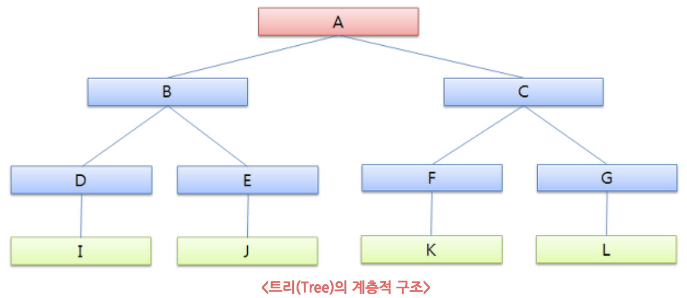
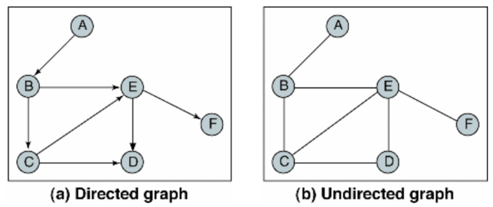

# Data Structure

### index

- 배열과 리스트 (Array and List)
- 스택과 큐 (Stack and Queue)
- 트리 (Tree)
- 이진 트리 (Binary Tree)
- 이진 탐색 트리 (BST, Binary Search Tree)
- 레드 블랙 트리 (Red Black Tree)
- 그래프 (Graph)
- 깊이 우선 탐색 (DFS, Depth First Search)
- 너비 우선 탐색 (BFS, Breadth First Search)

## 배열과 리스트

#### 배열 (Array)

배열 여러 데이터를 하나의 이름으로 그룹핑해서 관리하기 위한 가장 기본적인 자료구조이다. 내부 인덱스를 가지고 있어 데이터 접근시 인덱스를 통해 데이터에 접근하며, 속도가 빠르고 무작위 접근(Random Access)가 가능하다는 장점이 있다.

 하지만 배열은 생성시 크기를 지정해야 하며, 크기를 수정 할 수 없다. 너무 크게 생성할 경우 메모리 낭비 문제를 초례하며, 적을 경우 데이터를 모두 담을 수 없다. 생성한 배열을 크기보다 더 많은 데이터를 담아야 하는 경우, 기존의 배열보다 더 큰 배열을 새로 생성해야하는 불편함이 있다. 또한 배열에 담긴 데이터를 일부분 삭제하는 경우, 특정 데이터의 뒤에 위치해있는 모든 데이터를 이동시켜야함으로 추가적인 연산이 발생한다. 따라서 배열은 참조 및 조회 시에 빠른 속도를 자랑하며, 데이터의 수정 및 삭제가 빈번히 일어나는 로직의 경우 배열 사용을 피해야 한다.

#### 리스트 (List)

리스트는 빈틈없는 데이터의 적재라는 장점을 취한 자료구조로, 리스트 핵심은 요소들 간의 순서(시퀀스, Sequence)가 있으며, 순서가 있는 데이터의 모임을 리스트라 한다. 리스트는 배열과 다르게 원소의 수정 또는 삭제의 연산에 O(1)이라는 연산 능력을 가진다. 하지만 데이터 참조 및 조회 연산에서는 첫 번째 원소부터 접근을 해야되는 단점을 가지고 있다. 배열과는 달리 논리적 저장 순서와 물리적 저장 순서가 일치하지 않기 때문이다. 

### 스택과 큐

#### 스택 (Stack)

스택은 선형 자료구조의 일종으로 나중에 들어간 원소가 먼저 나온다는 방식의 Last In First Out (LIFO)이 특징인 자료구조이다. 의미상 데이터가 쌓이고 조회시 가장 위에 쌓인 데이터부터 접근하는 것을 의미한다. 

#### 큐 (Queue)

큐는 선형 자료구조의 일종으로 먼저 들어간 원소가 가먼 먼저 나오는 방식인 First In First Out (FIFO)이 특징인 자료구조이다. FIFO를 선입선출이라고도 부르며, 프로세스 처리, CPU 관리 등에서 많이 사용되는 자료구조이다. 

### 트리

트리는 스택과 큐와는 방대의 비선현 자료 구조이다. 계층적 관계(Hierarchical Relationship)를 표현하는 자료구조이며, 데이터 접근의 사고를 벗어나 표현에 집중하는 자료구조이다. 트리의주된 목적은 탐색이며, 의사 결정, 파일 시스템(디렉토리 구조), 검색 엔진, DBMS, 라우터 알고리즘, 계층적 데이터를 다루는 등 매우 다양한 곳에서 응용이 되고 있다. 

- 노드 (Node): 트리를 구성하고 있는 각각의 요소
- 간선 (Edge): 트리를 구성하기 위해 노드와 노드를 연결하는 선
- 루트 노드 (Root Node): 트리 구조에서 최상위에 위치한 노드
- 단말 노드 (Terminal Node, Leaf Node): 최하위에 위치한 노드로, 하위에 다른 노드가 연결되어 있는 않은 노드
- 내부 노드, 비단말 노드 (Intenal Node): 단말 노드를 제외한 모든 노드 (루트 노드 포함)

- 차수 (Degree): 어떤 노드가 가지고 있는 자식 노드의 수
- 레벨 (Level): 트리의 각 층의 번호
- 높이 (Height): 루트 노드를 시작으로 최하위 노드인 단말 노드까지의 깊이

### 이진 트리 (Binary Tree)

모든 노드가 최대 두 개의 자식 노드를 가지는 트리 구조를 말한다. 이 두 자식 노드를 왼쪽 자식 노드와 오른쪽 자식 노드라 부르며, 원래의 노드를 부모 노드라한다. 이진 트리는 이진 탐색 트리와 이진 힙의 구현에 흔히 쓰인다. 

이진 트리는 크게 포화 이진 트리(Full Binary Tree), 완전 이진 트리(Complete Binary Tree), 편향 이진 트리(Skewed Binary Tree)로 나뉘며, 모든 레벨이 꽉 찬 이진 트리인 경우 이를 포화 이진 트리라하며, 위에서 아래오 왼쪽에서 오른쪽으로 순서대로 채워진 트리를 완전 이진 트리라 한다. 편향 이진 트리는 루트 노드를 제외한 모든 노드가 부모 노드의 왼쪽 자식 노드이거나 오른쪽 자식 노드일 때를 말한다. 노드의 방향이 한쪽 방향으로 치우쳐 있는 트리이다.

#### 이진 탐색 트리 (Binary Search Tree)

이진 트리의 일종인 이진 탐색 트리는 효율적인 탐색을 위해 아래와 같은 속성을 가진 이진 트리 자료구조이다.

- 이진 탐색 트리의 노드에 저장된 키는 유일하다.
- 루트 노드의 키가 왼쪽 서브 트리를 구성하는 어떤 노드의 키보다 크다.
- 루트 노드의 키가 오른쪽 서브 트리를 구성하는 어떤 노드의 키보다 작다.
- 왼쪽과 오른쪽 서브 트리도 이진 탐색 트리이다.

이진 탐색 트리의 연산은 O(log n)의 시간 복잡도를 갖으며, 정확히는 O(h)이다. 높이를 하나씩 더해갈 수 록 추가할 수 있는 노드의 수가 두배씩 증가하기 때문이다. 이진 탐색 트리가 편향 이진 탐색 트리의 경우 한 쪽으로만 노드가 추가되기 때문에 Worst Case가 되며, 이 때의 시간 복잡도는 O(n)이다.

배열보다 많은 메모리를 사용하며 데이터를 저장했지만 탐색이 필요한 시간 복잡도를 같게 되는 비효율적인 상황이 발생한다. 이를 해결하기 위해 Rebalancing 기법이 등장했다. Revalancing은 트리의 균형을 잡기 위해 구조를 재조정하는 것을 말한다. 이 기법을 구현한 대표적으로 트리는 Red-Black Tree가 있다. 

#### 레드 블랙 트리 (Red Black Tree)

이진 탐색 트리 기반의 트리 형식의 자료 구조로, 데이터의 조회 및 수정, 삭제 등의 연산에 O(log n)의 시간 복잡도를 갖는다. depth를 최소화하여 시간 복잡도를 줄였으며, 최악의 경우에도 일정한 실행 시간을 보장(Worst-Case Guarantees)한다. 각각의 노드가 레드나 블랙인 색상 속성을 갖고 있으며, 아래의 성질을 만족한다.

- 각 노드는 레드 또는 블랙의 색상 속성을 가진다.
- 루트 노드의 색상을 블랙이다.
- 단말 노드는 블랙이다.
- 특정 노드의 색상이 레드라면, 하위의 두 노드의 색상을 모두 블랙이다.
- 레드 노드는 연달아 나타날 수 없으며, 블랙 노드만이 레드 노드의 부모 노드가 될 수 있다.
- 어떤 노드로부터 시작되어 단말 노드에 도달하는 모든 경로에는 단말 노드를 제외하면 모두 같은 개수의 블랙노드가 있다.

### 그래프 (Graph)

그래프는 트리와 비슷하게 연결되어 있는 원소간의 관계를 표현하는 자료구조이다.  원소를 나타내는 정점(Vertex)와 원소 사이의 연결선인 간선(Edge)의 집합으로 구성된다. 정점과 간선의 연결 관계에 있어서 방향성이 없는 그래프를 Undirected Graph라 하며, 간선에 방향성이 포함되어 있는 그래프를 Directed Graph라 한다.

그래프는 정점간에 여러 개의 간선이 존재할 수 있다. 다른 정점에서부터 오는 간선의 개수를 In-degree라 하며, 다른 정점으로 가는 간선의 갯수를 Out-degree라 한다. 트리의 노드는 하나의 In-degree만 가지는 반면, 그래프의 정점은 하나 이상의 In-degree를 가질 수 있다. 모든 장점이 간선으로 연결되어 있는 형태의 그래프를 완전 그래프하 하며, 그래프의 부분 집합을 부분 그래프라 한다.

그래프는 코드로 표현하는 방법에 따라 크게 두 가지로 나뉜다.  이차원 배열을 사용하여 인접 행렬(Adjacent Matrix)을 이용해 특정 위치의 값을 이용해 정점간의 연결 관계를 O(1)로 파악할 수 있는 방법과 연결 리스트를 사용하여 인접 리스트(Adjacent List)를 사용하는 방법이 있다.

### 깊이 우선 탐색 (DFS, Depth First Search)

그래프 상에 존재하는 임의의 한 정점으로부터 연결되어 있는 한 정점으로만 나아가는 방법을 말한다. 한 정점에서 시작되어 더 이상 나아갈 길이 보이지 않을 만큼 깊이 들어가며, 더 이상 나아갈 길이 존재하지 않는 다면 이전의 위치로 돌아와 다른 길을 선택하여 움직인다. 

### 너비 우선 탐색 (BFS, Breadth First Search)

깊이가 1인 모든 정점을 지나, 다음 깊이 2인 모든 정점을 지나고 최종적으로 깊이가 n인 모든 정점을 지나 더 이상 방문할곳이 없을 경우 탐색을 마친다. 깊이 우선 탐색과는 다르게 더 이상 나아갈 길이 보이지 않을 만큼 깊이 들어가는 것이 아닌, n 깊이에 연결된 정점을 살핀다. 깊이 우선 탐색은 스택을 통해 재귀 호출을 이용하고, 너비 우선 탐색은 방문한 정점의 위치를 기억하기 위해 큐를 사용한다.

### ref

- [배열(Array)과 리스트(List)](https://wayhome25.github.io/cs/2017/04/17/cs-18-1/)
- [Part 1-2 DataStructure](https://github.com/JaeYeopHan/Interview_Question_for_Beginner/tree/master/DataStructure#array-vs-linkedlist)
- [트리(Tree)](http://blog.eairship.kr/215)
- [그래프](https://gist.github.com/singun/1d628d0e3d66c60f9856)