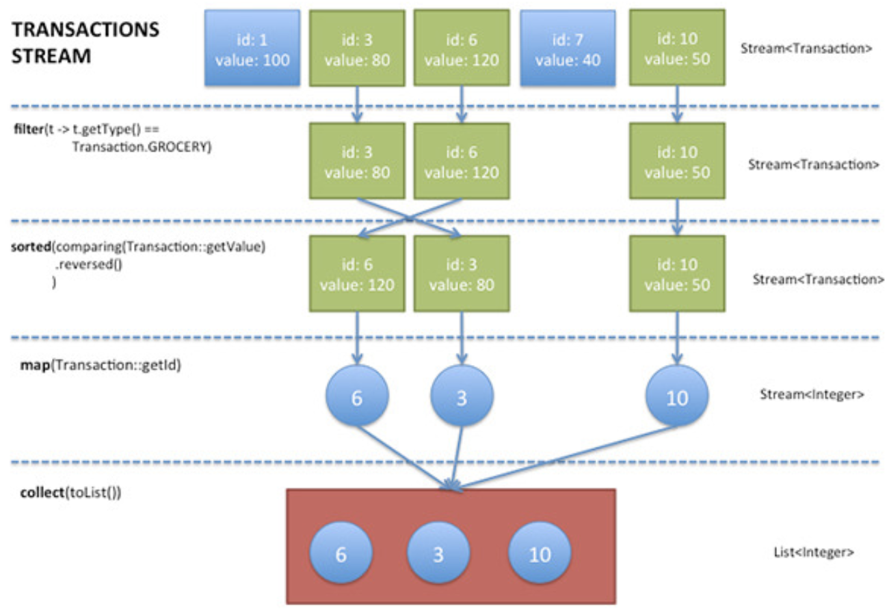

# Java Stream API

### index

- 개요

- 처리 흐름

- Stream Vs Collection

- 기능

- IntStream

- Looping

- Ref

  ​

## 개요

Java SE 8이 출시되면서 Stream이라는 새로운 API가 공개되었고, 이를 통해 쿼리를 작성하듯 데이터를 명식적인 방법으로 처리할 수 있게 됐다. Stream은 멀티 코어 환경을 지원하기 때문에 멀티 스레드와 관련된 코드를 작성할 필요가 없다. 기본적인 동작 방식은 Stream() 메소드를 통해 Stream을 가져오고, 그 다음 여러가지 기능을 체임처럼 엮어서 데이터를 처리한다.

````java
Stream();
Stream().filter().sorted().map().collect();
````

Stream의 정의는 "집계 연산을 지원하는 요소의 순서 (a Sequence of Elements from a Source that supports Aggregate of Operations)"이다. 

- Sequence of Elements: Stream은 정의된 엘리먼트의 속성에 따라 처리할 수 있는 인터페이스를 제공하지만 실제 엘리먼트들을 저장하지 않고 연산만 한다.
- Source: Stream은 컬렉션, 배열, I/O 리소스 등에서 제공받은 데이터를 가지고 연산한다.
- Aggregate Operations: Stream은 SQL과 같은 처리를 지웒고, 함수형 같은 처리 방법도 지원한다. (filter, map, reduce, find, match, sorted ...)

Stream은 기존 컬렉션 처리 방법과 구분되는 두 가지 특징이 있다.

- Pipelining: Stream에서 지원하는 기능들은 반환 타입을 Stream으로 가지며, 이는 여러가지 연산 작업을 체인처럼 연결하여 큰 파이프라인처럼 동작한다. 이러한 연산 작업은 lazieness와 Shot Circuiting과 같은 최적화 작업을 가능하게 한다.

  ```
  Laziness와 Short Circuiting은 and 연산자 앞에서 항이 false이면 뒤의 항의 연산을 하지 않는 것과 or 연산자에서 앞의 항이 true이면 뒤의 항의 연산을 하지 않는 것을 의미한다.
  ```

- Internal Iteration: 명시적으로 반복 작업을 수행해야 하는 Collection과는 다르게 Stream의 작업은 내부에서 처리된다.

  ​

## 처리 흐름



- 스트림을 시작하기 위해 Stream() 메서드를 생성하고, 특정 컬렉션의 목록을 Stream으로 가져온다.

- 다은 몇 가지 집계와 관련된 연산을 진행한다. 여러가지의 기능이 체인처럼 연결되어 파이프라인 형태로 처리된다.

  - filter: 특정 조건에 부합한 필터링
  - sorted: Comparator를 통한 정렬
  - map: 데이터 추출

- Stream은 마지막으로 연산의 결과를 반환 받기 위해 collect() 메소드를 사용한다. collect() 메소드의 파라키터를 갖지고 반환 값의 타입을 결정한다.

- collect() 메소드를 제외한 모든 연산들은 collect() 메소득 호출되기 전까지 실제로 실행되지 않는다. collect()는 파이프라인에 연결된 집계 작업을 시작하고 완료되면 결과를 반환한다.

  ​

## Stream Vs Collection

| Stream                                   | Collection                               |
| ---------------------------------------- | ---------------------------------------- |
| 데이터 연산                                   | 데이터 저장                                   |
| 연산 후 새로룬 데이터 생성                          | 메모리에 저장되는 데이터 구조                         |
| 내부적인 반복을 사용하여 사용자는 결과 값에 대한 처리만 정의하면 된다. (내부적) | 인터페이스를 사용하기 위해 사용자가 직접 정의된 반복문을 사용한다. (외부적) |


## Stream Operations: Exploiting Streams to Process Data

Stream의 연산들은 중간 작업 (Intermediate Operations)을 통해 연결될 수 있으며, 각각읜 연산들의 반환 타입은 Stream 타입이다. 작업의 종료는 종료 작업 (Terminal Operations)를 통해 종료되며, 이때 반환 타입은 List, Integer, void 등의 다양한 형태로 반환할 수 있다. 중간 작업은 Stream 파이프라인에서 종료 작업이 호출되기 전까지 절대 수행되지 않으며, 이는 Laziness를 의미한다. 중간 작업은 보통 병합 (Merged)을 통해 데이터릴 처리하고, 종료 작업에게 이를 전달한다.

```java
List<Integer> members = Arrays.asList(1,2,3,4,5,6,7,8,9);

List<Integer> twoEvenSquares = members.stream().filter(n -> { 	
  System.out.println("filtering " + n);
  return n % 2 == 0;
}).map(m -> {
  System.out.println("mapping " + n);
  return n * n;
}).limit(2).collect(Collectors.toList());
```

위의 예제는 배열에 담긴 상수들 중 짝수를 찾아 그 수를 제곱하여 List로 반환하는 코드이다. stream() 메소드를 통해 member의 stream을 생성하고. filter() 메소드를 통해 짝수를 찾고, map() 메소드를 통해 리스트의 각 요소를 제곱하여 반환한다. limit() 메소드를 통해 갯수의 범위를 제한하고, 마지막으로 collect() 메소드를 통해 List로 반환한다.

```
Lazy Evaluation (느긋한 계산법)
컴퓨터 프로그래밍에서 느긋한 계산법은 계산의 결과 값이 필요할 때까지 계산을 늦추는 기법을 의미한다. 지연 계산법과 최소 계산법으로 나뉘며, 느긋하게 계산함으로써 상황에 불필요한 계산을 생략하여 성능을 향상시키고 복합 수식을 계산할 때 오류를 예방한다. 무한 자료 구조를 쓸 수 있고, 미리 정의된 것을 이용하지 않고 보통 함수로 제어 구조를 정의할 수 있다.
```


## 기능

####  Getting Stream

- Stream()

  컬렉션을 고려하여 스트림 생성

- parallelStream()

  컬렉션을 고려하여 병렬 스트림 생성

  ```java
  List<String> strings = Arrays.asList(1, 2, 3, 4, 5, 6);

  List<String> filtered = strings.stream().filter(string -> !string.isEmpty()).collect(Collectors.toList());
  ```


#### Working Stream

- forEach()

  Stream에 담긴 요소를 순회하며, Stream의 마지막에 사용된다. 

  ```java
  Arrays.asList(1, 2, 3).stream().forEach(System.out::println);
  ```

- map()

  Stream의 개별 요소마다 연산한다. 각 요소를 매핑한다.

  ```java
  Arrays.asList(1, 2, 3).stream().map(i -> i*i).forEach(System.out::println);
  ```

- filter()

  Stream의 각 요소를 순회하여 해당 조건에 부합한 요소만 모아 반환한다.

  ```java
  Arrays.asList(1, 2, 3).stream().filter(i -> 2 >= i).forEach(System.out::println);
  ```

- flatMap()

  Stream 내부에 있는 객체들을 연결한 Stream을 반환한다.

  ```java
  Arrays.asList(Arrays.asList(1, 2), Arrays.asList(3, 4, 5), Arrays.asList(6, 7, 8, 9)).stream().flatMap(i -> i.stream()).forEach(System.out::println);
  ```


- limit()

  Stream의 첫 번째 요소부터 파라미터로 선언한 인덱스까지의 요소로 범위를 줄여 반환한다.

  ```java
  Arrays.asList(1, 2, 3).stream().limit(3).forEach(System.out::println);
  ```

- skip()

  Stream의 첫 번째 요소부터 파라미터로 선언한 인덱스까지의 요소를 제외한 나머지  요소들을 반환한다.

  ``` java
  Arrays.asList(1, 2, 3).stream().skip(3).forEach(System.out::println);
  ```

- reduce

  Stream을 단일 요소로 반환한다.

  ```java
  Arrays.asList(1, 2, 3).stream().reduce((a, b) -> a-b).get();
  ```

  해당 예제를 통해 설명을 더하면, 첫 번째 연산으로 1과 2가 선택되어 연산이 되어 결과는 -1이 된다. 다음 연산에서는 방금 도출된 연산의 결과와 3이 선택되어 연산이되며, (-1) - 3을 연산하여 결과는 -4가 된다. 방금 전의 연산이 마지막 요소임으로 결과 값인 -4가 반환된다.

- collect()

  각 연산 메소드로 반환된 결과를 컬렉션 객체로 만들어 반환한다.

  ```java
  Arrays.asList(1, 2, 3).stream().collect(Collectors.toList());
  Arrays.asList(1, 2, 3).stream().iterator();
  ```


## IntStream

자바 8에서는 원시데이터형 int를 스트림으로 다룰 수 있는 기능인 IntStream을 제공하며, java.uitl.stream 패키지에 스트림 관련 API가 담겨있다.

#### Getting Stream

- IntStream.of(1, 2, 3, 4, 5);

  1에서 5까지의 int 스트림을 생성한다. of의 인자로 배열도 가능하다.

- IntStream.range(1, 5);

  1에서 4까지의 int 스트림을 생성한다.

- IntStream.rangeClosed(1, 5);

  1에서 5까지의 int 스트림을 생성한다.

- iterator()

  해당 조건에 따라 스트림을 생성한다

  ```java
  IntStream.iterator(0 , i -> i + 2).limit(4);
  ```

  위의 예제에서 iterator() 메소드는 0, 2, 4, 6 ... 형식으로 짝수에 대한 스트림을 생성하며, limit() 메소드를 통해 그 수를 제한하고 있다. 만일 iterator() 메소드의 조건과 limit() 메소드의 조건이 맞지 않으면 아래의 코드와 같이 무한 스트림이 발생할 수 있다. 논리적 오류에 주의해야 한다.

  ```java
  Intstream.iterator(0, i -> (i + 1) % 2).distinct().limit(10).forEach(System.out::println);
  ```

  limit() 메소드로 범위를 제한했지만, iterator() 메소드에서 0 또는 1만 반환하므로 무한 스트림에 빠진다. 

#### Working Stream

- anyMatch()

  조건 중 하나의 요소라도 일치하면 true를 반환한다.

  ```java
  IntStream.range(1, 5).anyMatch(i -> i % 2 == 0);
  ```

  주어진 범위 1 ~ 4 중 짝수가 있을 경우 true를 반환한다.

- allMatch()

  특정 범위에 있는 모든 요소가 조건에 전부 일치할 경우 true를 반환한다.

  ```java
  IntStream.range(1 ,5).allMatch(i -> i % 2 == 0);
  ```

  주어진 범위 1 ~ 4 중 전부 짝수일 경우 true를 반환한다.

- noneMatch()

  특정 범위에 있는 모든 요소가 조건에 전부 일치하지 않을 경우 true를 반환한다.

  ```java
  IntStream.rangt(1 ,5).noneMatch(i -> ii % 2 == 0);
  ```

  주어진 범위 1 ~ 4 중 전부 홀수 일 경우 true를 반환한다.

- filter()

  범위를 대상으로 전체를 돌며 조건에 해당하는 값을 반환한다.

  ```java
  IntStream.range(1, 5).filter(i -> i % 2 == 1);	//	1, 3
  IntStream.range(1, 5).filter(i -> i % 2 == 1).allMatch(i -> i % 2 == 1);	//	true
  IntStream.range(1, 5).filter(i -> i % 2 == 1).noneMatch(i -> i % 2 == 1);	//	false
  ```

- max(), min()

  범위를 대상으로 최댓값, 최솟값을 반환한다.

  ```java
  IntStream.range(1, 5).max().getAsInt();	//	4
  IntStream.range(1, 5).min().getAsInt();	//	1
  ```


## Looping

루핑 (Looping)은 요소 전체를 반복하는 것을 의미한다. 자바 8에서 루핑하는 메소드에는 peek(), foreEach() 메소드가 있고 이 두 메소드는 루핑한다는 기능적은 면에서는 동일하지만, 동작 방식에 대한 차이가 있다. 결론부터 얘기한다면 peek() 메소드는 중간 처리 메소드이며, forEach() 메소드는 최종 처리 메소드이다. 

peek() 메소드는 중간 처리 단계에서 전체 요소를 루핑하면서 추가적인 작업을 하기 위해 사용되며, Stream의 특성상 중간 처리 메소드는 최종 처리 메소드가 실행되지 않으면 지연되기 때문에 반드시 최종 처리 메소드의 호출이 필요하다. 결과적으로 하위의 코드는 실행되지 않는다.

```java
IntStream.filter(i -> i % 2 == 0).peek(i -> System.out.println(i));
```

위의 예제를 동작시키기 위해서는 최종 처리 메소드를 호출해야 하며, 하위의 코드는 sum()이라는 최종 메소드를 통해 결과를 확인할 수 있다.

```java
IntStream.filter(i -> i % 2 == 0).peek(i -> System.out.println(i)).sum();
```

반대로 forEach() 메소드는 최종 처리 메소드이기 때문에 파이프라인 마지막까지 루핑하면서 요소를 하나씩 처리한다. forEach() 메소드는 요소를 소비하는 최종 처리 메소드이므로, 해당 메소드 호출 이후에 다른 메소드를 호출할 수 없다.

## 

### Ref

- [Stream API](https://www.tutorialspoint.com/java8/java8_streams.htm)
- [Stream에서 사용할 수 있는 기능들](http://jdm.kr/blog/181)