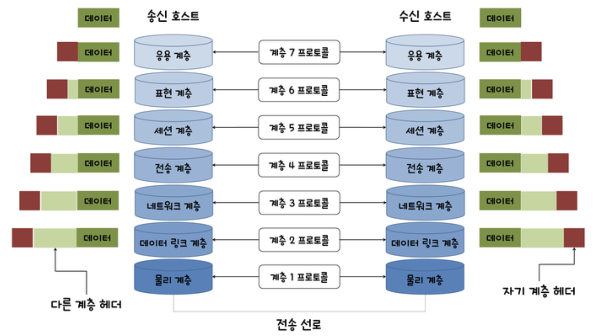
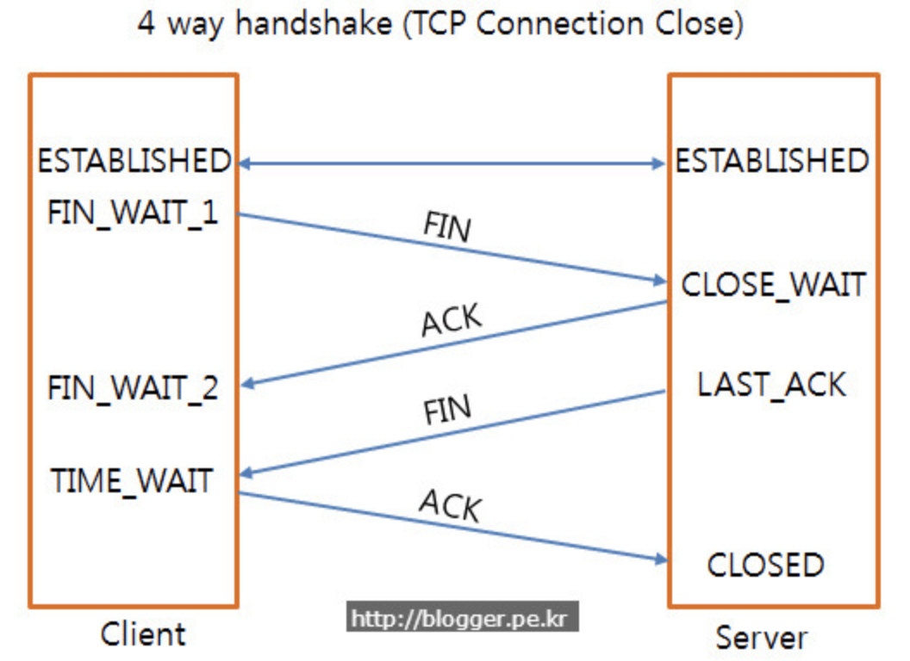
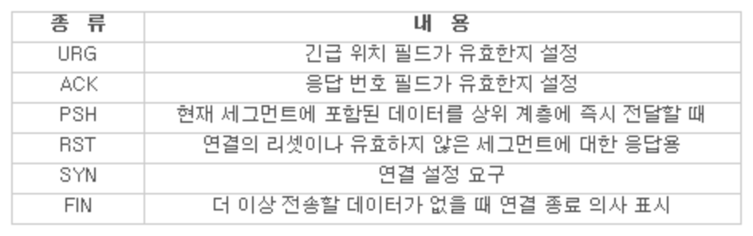
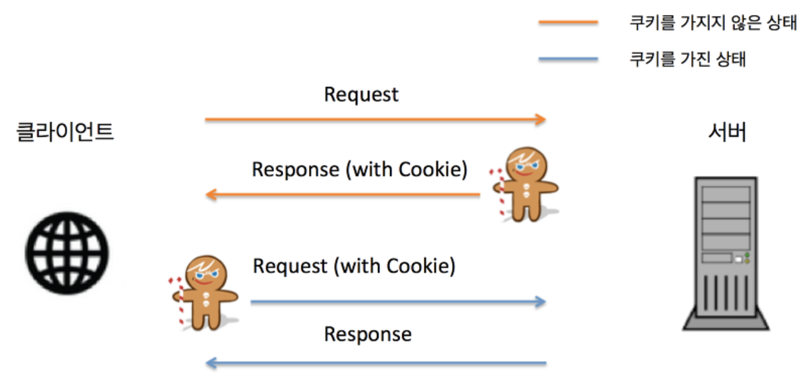

## Network

### index

- OSI 7 계층
- GET, POST
- TCP, UDP
- TCP 3-Way Handshake & 4-Way Handshake
- 세션과 쿠키
- Ref

-----

### OSI 7 계층

네트워크 상에서 여러 대의 컴퓨터가 데이터를 주고 받으며, 서로를 연동할 수 있게 표준화가 된 인터페이스가 OSI 7 계층이다. OSI(Open System Interconnection)는 국제 표준화 기구인 ISO(International Standard Organization)가  데이터 통신 환경에서 사용하기 위한 계층적 구현 모델의 표준이다.

각 계층마다 담당하는 역할이 나뉘며, 임의의 호스트에서 실행되는 계층 N 모듈은 상대 호스트의 계층 N 모듈과 논리적으로 통신되며 이를 N 프로토콜이라 한다. 각 계층의 상하에 있는 계층들과는 인터페이스를 통해 서비스를 이용하며, 송신 호스트에서 데이터를 전달할 때는 하위 계층에게 서비스를 요청한다. 최하위인 물리 계층에게까지 전달되면 물리적인 데이터 전송이 이루어지며, 이를 수신한 호스트에서는 상위 계층으로 데이터가 전달된다. 

각 계층별 주된 역할은 아래와 같다.

- 물리 계층

  물리적 매체를 통해 데이터 비트를 전송하기 위해 요구되는 기능을 정의하며, 두 호스트 간의 실제 접속 및 기계적, 전기적 특성에 대한 규칙을 정의한다.

- 데이터 링크 계층

  시스템 간의 효율적, 신뢰적 정보 전송올 위한 계층이며, 오류 검출 및 복구를 위한 오류 제어 기능을 수행한다. 송신측과 수신측의 속도 차이를 해결하기 위한 흐름 제어 기능을 지원한다. 대표적인 프로토콜에는 이더넷, MAC, PPP등이 있다.

- 네트워크 계층

  다중 네트워크 링크에서 발신지로부터 목적지까지 전달할 책임을 가지는 계층으로, 데이터 링크 계층에서 노드 대 노드로 데이터가 전송되는 것을 담당한다면 네트워크 계층은 시작점과 목적지까지의 데이터 전달을 담당하는 역할을 수행한다. 대표적인 프로토콜에는 IP, ICMP 등이 있다.

- 전송 계층

  종단과 종단 간의 제어 및 에러 검출을 담당하는 전송 계층은  패킷의 전송이 유효한지 확인하며 전송에 실패된 패킷을 재송신하는 등의 신뢰성을 보장한다. 주소 설정, 오류 및 흐름 제어, 다중화 등의 역할을 담당하며, 대표적인 프로토콜에는 TCP, UDP 등이 있다.

- 세션 계층

  양 끝단의 응용 프로세스가 통신을 관리하기 위한 방법을 제공하며, 동시 송수신(Duplex), 반이중(Half-Duplex), 전이중(Full-Duplex) 방식의 통신과 체크 포인팅 등을 수행한다. 통신 세션을 구성하며 포트 번호를 기반으로 연결된다. 대표적인 프르토콜로는 SSH, TLS 등이 있다.

- 표현 계층

  상위 계층에서 전달받은 데이터를 하위 계층으로 보내기 전에 통신에 적합한 형태로 변환하는 역할을 담당하며, 반대로 하위 계층으로부터 수신된 데이터를 상위 계층에게 맞도록 변환하는 역할을 한다. 대표적인 프르토콜에는 JPG, MPEG 등이 있다.

- 응용 계층

  일반적인 응용 서비스를 수행하며, 정보 교환, 전자 메일, 파일 전송 등의 서비스가 대표적이다. 프로토콜로는 DNS, FTP, HTTP 등이 있다.

-----

### GET, POST

GET은 클라이언트가 입력한 쿼리의 이름과 값이 결합되어 스트링 형태로 서버에게 전달된다. 1 회 요청 당 전송 데이터의 양은 주소 값 + 파라미터 255자로 제한되어 있으며, HTTP/1.1인 경우 2048자 까지 가능하다. 단순히 요청에 의한 정도로 사용되며, URL에 그대로 쿼리의 이름과 값이 연결되여 표현되므로 외부에 노출된 형태이다. 보안이 필요한 데이터의 경우 url에 노출됨으로 GET 방식의 사용이 적절하지 않다. GET의 주된 목적은 특정 데이터의 조회를 위한 것이며, 특정 값 또는 상태를 주입 및 갱신의 목적으로 사용하는 것은 옳지 않다.

POST는 클라이언트와 서버 간의 데이터를 인코딩과 디코딩하여 통신한다. 헤더를 통해 요청이 전송되며, 데이터의 양은 제한이 없다. 클라이언트가 서버에게 데이터를 보낼 때, 데이터를 인코딩하여 송신하고, 이를 수신하는 서버는 데이터를 디코딩하여 사용한다. 데이터는 body 영역에 있으며, GET에 비해 보안은 비교적 유리한 편이다. 

여기서 GET과 POST의 차이는 GET은 가져온다는 개념이며, POST는 수행한다는 개념에서 있다. GET의 특정 값, 상태, 내용 등을 수정하지 않으며 조회하는 기능이고, POST는 서버의 값, 상태, 내용 등을 주입하거나 수정하기 위해 사용된다.

-----

### TCP, UDP

TCP(Transmission Control Protocol)는 인터넷 상에서 데이터를 메시지의 형태로 보내기 위해 IP와 함께 사용하는 프로토콜로, 호스트 간의 신뢰성 있는 데이터를 전달하고 흐름 제어 및 혼잡 제어 등의 기능을 제공하는 전송 계층의 연결 지향형 프로토콜이다. 연결형 서비스로 신뢰성을 보장하기 때문에 서버와 클라이언트는 1 대 1로 연결되며, 연결 확립을 위한 3-Way Handshake 과정과 연결 해제를 위한 4-Way Handshake 과정을 거친다. 흐름 제어나 혼잡 제어 등의 기능을 지원하지만, 이 때문에 UDP와 상대적으로 속도가 느리다. 전송 데이터의 크기는 무제한이며, 연속성보다는 신뢰성을 지향하는 프로토콜이다.

UDP(User Datagram Protocol)는 데이터를 데이터그램 단위로 처리하는 프로토콜이다. 호스트간의 데이터 전달 및 오류 검출 기능만 제공하는 비연결형 전송 프로토콜로, 포트만 확인하여 소켓을 식별하고 통신이 이루어진다. 서버와 클라이언트는 1 대 1, 1 대 다, 다 대 다의 연결이 가능하며, 데이터그램(메시지) 단위의 전송으로 인해 크기에 제한이 있다. TCP에 비해 빠른 속도를 가지고 있지만, 전송의 신뢰성이 낮으며 데이터의 손실 가능성이 있다. 네트워크 부하가 적다는 장점이 있으며, 신뢰성보다는 연속성이 중요한 서비스에서 사용된다. 대표적으로 실시간 서비스(Streaming)이 있다.

-----

###  TCP 3-Way Handshake & 4-Way Handshake

TCP는 연결 지향형 프로토콜로, 통신을 위해서 호스트간의 연결이 필요하며 통신이 끝난 후에는 연결을 종료해야 한다. 연결 성립에는 3-Way Handshake 방식을 사용한다.

- 클라이언트는 서버에 접속을 요청하는 SYN 패킷을 전송한다.
- 서버는 클라이언트의 요청인 SYN을 받고 클라이언트에게 요청에 대한 응답으로 ACK와 SYN 패킷을 송신한다.
- 클라이언트는 이를 수신하고 ACK 패킷을 서버에게 보내며 연결이 성립(Establish)된다.

연결 해제를 위해 4-Way Handshake 방식을 사용하며, 과정의 아래와 같다.

- 클라이언트는 연결의 종료를 의미하는 FIN 패킷을 송신한다.
- 서버는 클라이언트의 FIN 패킷을 수신하고 그에 대한 응답으로 ACK 패킷을 전송한다. 그 후 서버는 데이터를 모두 송신할 때까지 TIME_OUT이 된다.
- 데이터 전송이 완료가 되면, 서버는 연결이 종료되었다는 FIN 패킷을 클라이언트에게 전송한다.
- 클라이언트는 FIN 패킷 수신하고 그에 대한 응답의 ACK 패킷을 전송한다.
- 클라이언트의 ACK 패킷을 받은 서버는 TCP 소켓 연결을 Close한다.
- 클라이언트는 서버로부터 아직 받지 못한 데이터가 있을 경우를 대비해 일정 시간동안 세션을 남겨 놓은 후 대기한다. (TIME_WAIT)

-----

### 세션과 쿠키

쿠키과 세션은 HTTP 프로토콜의 단점을 보완하기 위해 존재한다. HTTP의 기본적인 특징은 Connectionless와 Stateless이며, 이 특징을 통해 연결 유지에 대한 자원 낭비를 방지한다는 장점을 가진다.

- Connectionless: 클라이언트가 서버에게 요청(Request)를 전송하며, 서버는 클라이언트에게 응답 (Response)를 보내고 서로 접속을 끊는다.
- Stateless: 클라이언트와 서버의 통신이 끝난 후 연결을 끊는 순간 상태 정보를 유지하지 않는다.

이러한 특징은 이면적인 부분에서 단점이 될 수 있다. 기본적인 예로 클라이언트가 서버에게 요청을 보낼 때마다 인증에 대한 정보가 항상 담겨있어야하며, 반복되는 요청에 반복되는 인증 절차를 거쳐야만 한다. 이러한 단점을 보완하기 위해 HTTP는 서버가 클라이언트를 식별할 수 있는 세션과 쿠키 기능을 지원한다.

- 쿠키 (Cookie)

  쿠키는 클라이언트에 저장되는 키와 값이 들어있는 작은 데이터 파일이다. 이름, 값, 만료 기간, 경로 정보 등으로 구성되어 있으며, 일정 시간동안 데이터를 저장함으로써 로그인 상태를 유지한다. 클라이언트의 하드 디스크에 상태 정보가 저장되며, 필요 시 참조, 재사용이 된다. 쿠키의 단점은 쿠키의 크기와 저장 가능한 갯수가 제한되어 있다. 쿠키의 크기는 4096 바이트(Byte)까지만 저장이 가능하며, 클라이언트에 총 300개까지 저장할 수 있고, 하나의 도메인에 최대 20개의 값만 가질 수 있다. 

  

  클라이언트가 쿠키를 얻어서 사용하는 과정은 위의 그림과 같다. 클라이언트가 브라우저로 웹 페이지에 접속하고(Request) 요청한 웹 페이지를 받으면(Response), 쿠키는 클라이언트의 하드 디스크에 저장된다. 이후 클라이언트가 재방문시 웹 페이지 요청과 함께 쿠기 값도 함께 전송하며, 지속적으로 로그인 정보를 가지고 있는 것처럼 사용된다. 예로는 방문한 사이트에서 아이디와 비밀번호를 저장하는 기능과 방문한 사이트의 팝업을 하루 동안 보지 않겠다는 기능, 쇼핑몰에서 장바구니 기능이 대표적이다.

- 세션 (Session)

  세션은 클라이언트와 웹 서버 간의 네트워크 연결이 지속 유지되고 있는 상태를 의미한다. 사용자가 브라우저를 열어 서버에 접속한 뒤 접속이 종료 할 때 까지의 시점을 의미한다. HTTP는 비접속형 프로토콜로, 매접속시마다 새로운 네트워크 연결이 이루어지며, 세션이 연결을 유지하는 기능을 지원한다. 클라이언트가 웹 서버에 요청을 전송하면, 이를 수신한 서버의 엔진이 클라이언트에게 유니크한 식별자를 부여하며, 이 식별자를 세션이라 한다. 세션 식별자는 임시로 저장되며 페이지 이동, 재접속 등에서 클라이언트를 구분하는 수단으로 사용된다. 이를 통해 얻을 수 있는 이점은 정보를 서버에서 관리함으로써 쿠키보다 비교적 보안에 강하다.

쿠키과 세션의 가장 큰 차이점은 정보를 어디에 저장하는지에 있다. 쿠키는 클라이언트에 저장되며 세션은 서버에 저장된다. 쿠키는 클라이언트의 자원을 사용하며, 세션은 서버의 자원을 사용한다. 쿠키는 비교적 세션보다 속도가 빠르며, 세션은 서버의 처리에 의해서 쿠키보다 속도가 느리다. 쿠키와 세션이 같이 사용되는 이유는 서버 측의 한정된 자원에 세션의 무분별한 사용에 의한 서버 과부하의 문제를 예방하기 위해서 이다.

-----

### Ref

- [OSI 7 계층](https://blog.naver.com/madplay/220404207107)
- [Network](https://github.com/JaeYeopHan/Interview_Question_for_Beginner/tree/master/Network)
- [GET과 POST의 차이](https://blog.outsider.ne.kr/312)
- [네트워크 전송 GET, POST 비교](http://interconnection.tistory.com/72)
- [TCP와 UDP 프로토콜](http://mintnlatte.tistory.com/306)
- [TCP와 UDP 차이 그리고 TCP/IP](https://m.blog.naver.com/PostView.nhn?blogId=madplay&logNo=220511097703&proxyReferer=https%3A%2F%2Fwww.google.co.kr%2F)
- [쿠키와 세션 개념](http://interconnection.tistory.com/74)
