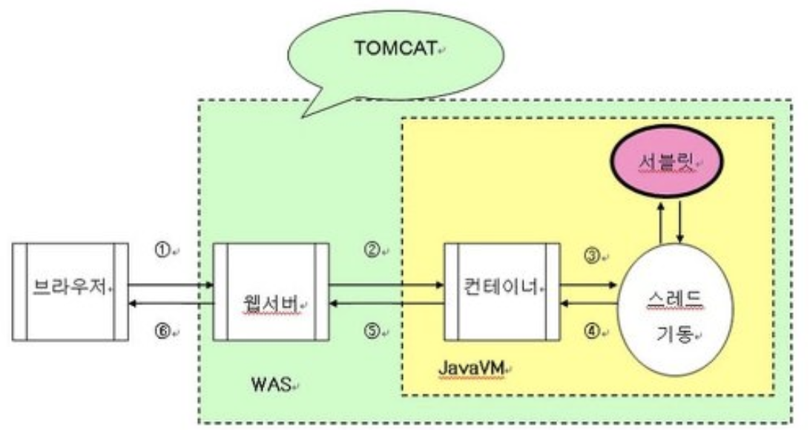

# Web Development

### index

- JSP, Servlet
- Spring
- DI, IOC
- Container
- Mybatis

-----

## JSP, Servlet

정적 콘텐츠만으로 웹 기술을 업무에 이용하기는 것에 한계를 느끼게 되었고, 이를 계기로 CGI(Common Gateway Interface) 기술이 등장했다. CGI는 HTTP의 요청에 의해 실행되는 프로그램으로, 웹 브라우저의 요청을 받아 CGI가 해당 프로그램을 실행시키믕로써 같은 요청에 대해 다른 처리 결과를 반환할 수 있게 했다. 하지만 CGI는 처리를 요청할 때마다 프로그램이 실행되는 점과 세션 관리가 없다는 단점이 있고, 요청이 많아지면 성능 저하 또는 트랜잭션 관리의 문제점이 발생했다. 이를 보완하기 위해 JSP와 Servlet이 등장했다. JSP와 Servlet은 멀티 스레드로 실행되며, 웹 컨테이너가 세션 관리를 대신 한다. 또한 페이지 생성 로직과 비즈니스 로직을 분리함으로서 페이지 생성은 JSP에서, 비즈니스 로직은 Servlet에서 처리할 수 있게 되었다.

-----

## Spring

특정 목적에 맞게 프로그래밍을 쉽게 하기 위한 약속을 프레임워크라 하며, 자바 기반으로 다양한 어플리케이션을 제작하기 위한 약속된 프로그래밍을 스프링(Spring)이라 한다. 스프링을 통해 다양한 어플리케이션을 쉽고 빠르게 만들 수 었으며, 부품을 생성하고 조합하는 라이브러리 집합체라 할 수 있다.

스프링은 MVC 프레임워크와 JDBC를 추상화한 프레임워크 등 여러 끼능을 개발자에게 제공하는 어플리케이션 아키텍처 베이스이다.

-----

## DI, IoC

### IoC (Inversion of Control, 제어의 역전)

IoC은 프로그램의 제어 흐름 구조가 뒤바뀌는 것으로, 모든 제어 권한을 자신이 아닌 다른 대상에게 위임하는 것을 의미한다. 엔트리 포인트를 제외한 모든 오프제그드들이 위임받은 제어 권한을 갖는 특별한 오브젝트에 의해 만들어지며, 제어권을 상위 템플릿 메소드에 넘기고 자신은 필요할 때 호출되어 사용된다. 

스프링에서 제어권을 가지고 생성하여 관계를 부여하는 오브젝트를 빈(Bean)이라 하며, 오브젝트 단위의 어플리케이션 컴포넌트, 스프링 컨테이너가 생성과 관계 설정, 사용 등의 제어해주는 제어의 역전이 적용된 오프젝트 등을 의미한다.

IoC는 컨테이너이다. 기존에 자바 기반의 어플리케이션을 개발할 때 자바 객체를 생성하고 서로간의 의존 관계를 연결시키는 작업에 대한 제어권은 개발되는 어플리케이션에 있었지만, 컨테이너의 개념이 도입되면서 객체의 생명 주기(라이프사이클)을전담하게 되었다. 객체의 생성부터 생명 주기의 관리까지 모든 객체에 대한 제어권이 IoC 컨테이너로 바꾸었다.

### DI (Dependency Injection, 의존 관계 주입)

오브젝트를 다른 오브젝트에 주입하는 것이 아닌, 오브젝트의 레퍼런스가 전달되는 것을 의미한다. 오브젝트 레퍼린스를 외부로부터 주입받고, 이를 통해 다른 오브젝트와 동적으로 의존 관계가 만들어진다.

의존 관계는 두 개의 클래스 또는 모듈이 의존 관계에 있다하면 항상 방향성이 부여된다. UML 모델에서 두 클래스의 의존 관계를 점선으로 된 화살표로 표현한다.

- [A Calss] ——> [B Class]

B 클래스의 기능이 추가, 변셩, 형식의 변화 등이 생기면 A 클래스에게 전달된다. A 클래스가 B 클래스에 의존하지 있지만, 반대로 B 클래스는 A 클래스에 의존하지 않는다. B 클래스는 A 클래스의 변화에 영향을 받지 않는다.

인터페이스에 대해서만 의존 관계를 만들어 두는경우, 인터페이스 구현 클래스와의 관계는 느슨해지면서 변호에 영향을 덜 받는 상태가 된다. 이를 결합도가 낮다고 얘기하낟. 프로그램이 시작되고 특정 오브젝트라 만들어지면 런타임시에 의존 관계를 맺는 대상이 되며, 실제 사용 대상인 오브젝트를 의존 오브젝트(Dependent Object)라 한다. 의존 관계 주입은 구체적인 의존 오브젝트와 그것을 사용할 주체, 보통 클라이언트라 부르는 오브젝트를 런타임시에 연결해주는 작업을 말한다. 의존 관계 주입에는 3가지 조건을 충족하는 작업을 말한다.

- 클래스 모델이나 코드에는 런타임 시점의 의존 관계가 드러나진 않는다. 그러기 위해 인터페이스에만 의존하고 있어야 한다.
- 런타임 시점의 의존 관계는 컨테이너나 팩토리 같은 제 3의 존재가 결정한다.
- 의존 관계는 사용할 오브젝트에 대한 레퍼런스를 외부에서 주입함으로써 생성된다.

### IoC와 DI의 관계

스프링 프레임웤그의 가장 큰 장점으로 IoC 컨테이너 기능이 부각되었으나, IoC 기능은 스프링 프레임워크가 탄생하지 이전부터 사용되던 개념이다. "IoC 기능을 스프링 프레임워크의 장점이 아닌, 새로운 개념을 사용하느 것이 적합하다"라고 주장하는 사람이 마틴 파울러이다. 마틴 파울러의 주장 이후, IoC 개념을 개발자들마다 다양한 방식으로 분류하고 있으나, 일반적으로 IoC와 DI 간의 관계는 아래와 같이 분류된다.

-----

## Container

보통 인스턴스의 생명 주기를 관리하며, 생성된 인스턴스에게 추가적인 기능을 제공하도록 하는 것이라 말한다. 개발자가 작성한 코드의 처리 과정을 위임받은 독립적인 존재이며, 적절한 설정을 통해 작성된 코드를 스스로 참조하여 객체의 생성과 소멸을 관리하는 기능을 하는 개체를 의미한다.

Servlet 컨테이너는 Servlet의 생성, 초기화, 실행, 소멸 등의 모든 권한을 가지며, Servlet 인스턴스의 생명 주기를 관리하는 기능과 접근 권한, 보안 등의 서비스를 지원한다 

스프링 컨테이너는 스프링 프레임워크의 핵심부에 속하며, 종속 객체 주입을 이용하여 어플리케이션을 구성하는 컴포넌트를 관리한다. 개발자가 작성한 코드를 컨테이너를 사용하여 객체르리 생성 및 관리한다. 스프링 컨테이너의 종류에는 빈 팩토리(BeanFactory)와 어플리케이션 컨텍스트(ApplicationContext)가 있다. 빈 팩토리는 DI의 기본 사항을 제공하는 가장 단순한 컨테이너로, 빈을 생성하고 분배하는 책임을 갖는 클래스이다. 빈 팩토리는 Lazy Loading으로 정의는 즉시 이루어지지만, 빈이 직접 사용되기 전까진 인스턴스화를 하지 않는다. 어플리케이션 컨텍스트는 빈 팩토리와 유사하지만 더 많은 기능을 제공한다.

- 국제화가 지원되는 텍스트 메시지 관리
- 이미지 등의 파일 자원을 로드 할 수 있는 포괄적인 기능 제공
- 리스너로 등록된 빈에게 이벤트 발생을 알림

-----

## Mybatis

Todo

-----

##  JPA

Todo

-----

### ref

- 